```{r setup, include=FALSE}
options(htmltools.dir.version = FALSE)
knitr::opts_chunk$set(warning = FALSE, message = FALSE, 
                      fig.retina = 3, fig.align = "center")
```

```{r xaringanExtra, echo=FALSE}
xaringanExtra::use_xaringan_extra(c("tile_view"))
xaringanExtra::use_share_again()
```

```{r, echo=FALSE}
xaringanExtra::use_webcam()
```


class: center middle main-title section-title-4

# Los procesos laborales

.class-info[

.medium[**Paul Paredes**]

CICAJ | Departamento Académico de Derecho

.light.small[Pontificia Universidad Católica del Perú<br>
27 de octubre, 2021]

]

---

name: outline
class: title title-4

# Plan de la clase

--

.box-4.small[Presentación]

.box-4.small[Los procesos en la NLPT]

.box-4.small[El proceso ordinario laboral]

.box-4.small[El proceso abreviado laboral]

.box-4.small[Los presupuestos procesales y las condiciones de la acción]

.box-4.small[Informalismo y nulidades procesales]

.box-4.small[Otras consecuencias]

---

layout: false
name: audiencias
class: center middle section-title section-title-4 animated fadeIn

# Los procesos laborales

---

layout: true
class: title title-4

---
# Los tipos de procesos EN la NLPT

.box-4[El proceso ordinario laboral]

.box-inv-4[El proceso abreviado laboral]

.box-5[El proceso impugnativo de laudos arbitrales económicos]

.box-inv-5[El proceso cautelar]

.box-6[El proceso de ejecución]

.box-inv-6[Los procesos no contenciosos]

---
# Los tipos de procesos FUERA de la NLPT

.box-1[El proceso contencioso administrativo (D.S. 011-2019-JUS)]

.box-inv-1[El proceso de acción popular (CPConst.)]

.box-2[El proceso de anulación de laudo jurídico (D.Leg. 1071)]

.box-inv-2[El proceso de acción de amparo (CPConst.)]

.box-3[El proceso de inconstitucionalidad (CPConst.)]

.box-inv-3[El proceso de cumplimiento (CPConst.)]

---
# El proceso ordinario laboral

.box-4[1.Audiencia de conciliación]

.box-inv-4.small[El juez tiene una participación activa en la solución de las diferencias.]

.box-inv-4.small[La conciliación puede prolongarse lo necesario por decisión de las partes.]

.box-inv-4.small[El juez aprueba el acuerdo parcial o total, y también sobre los extremos no controvertidos, con calidad de cosa juzgada y ordena el cumplimiento de lo acordado.]

.box-inv-4.small[Los extremos no solucionados pasan a ser materia de juicio.]

.box-inv-4.small[El juez emite sentencia al finalizar la audiencia si la causa es de puro derecho o no hay necesidad de actuación probatoria (**juzgamiento anticipado**).]

---
# El proceso ordinario laboral

.box-4[2.Audiencia de juzgamiento]

.box-4.small[Incorpora las etapas de:]

.box-inv-4.small[**Confrontación de posiciones:** exposición de los argumentos de demandante y demandado.]

.box-inv-4.small[**Actuación probatoria:** actuación de todos los medios probatorios sólo de los hechos necesitados de prueba.]

.box-inv-4.small[**Alegatos:** argumentación de cierre de los abogados.]

.box-inv-4.small[**Sentencia:** a la conclusión de la audiencia o luego de 60 minutos. Excepcionalmente, dentro de 5 días hábiles siguientes.]

---

layout: false

background-image: url(https://raw.githubusercontent.com/PaulParedes/materiales/master/pol1.png)
background-size: contain


---

background-image: url(https://raw.githubusercontent.com/PaulParedes/materiales/master/pol2.png)
background-size: contain

---

layout: true
class: title title-4

---
# El proceso abreviado laboral

.box-4[Audiencia Única]

.box-4.smaller[Se estructura sobre la base de las audiencias de conciliación y de juzgamiento del proceso ordinario laboral.]

.box-4.smaller[Incorpora las etapas de:]

.box-inv-4.small[Conciliación]

.box-inv-4.small[Confrontación de posiciones]

.box-inv-4.small[Actuación probatoria]

.box-inv-4.small[Alegatos]

.box-inv-4.small[Sentencia]

---
layout: false

background-image: url(https://raw.githubusercontent.com/PaulParedes/materiales/master/pal.png)
background-size: contain

---
class: center middle section-title section-title-4 animated fadeIn

# Presupuestos procesales y condiciones de la acción

---

layout: true
class: title title-4

---

# Presupuestos procesales

## Para la existencia de una relación procesal válida



---
# Condiciones de la acción

## Presupuestos para la emisión de una decisión de fondo


---

layout: false
name: pretensiones
class: center middle section-title section-title-4 animated fadeIn

# Competencia (materia [tipo de relación], cuantía, grado, territorio)

---

layout: true
class: title title-4

---

# ¿Cuáles pretensiones?

--

.box-4.normal[Respuesta 1: (materia*)]

.box-inv-4.normal[Las pretensiones que están listadas en el artículo 2 de la NLPT, sin ser exclusivas.]

---
# ¿Cuáles pretensiones?

.box-4.normal[Las pretensiones relacionadas a los siguientes aspectos o temas:]

.box-inv-4.small[a) El nacimiento, desarrollo y extinción de la prestación personal de servicios; así como a los correspondientes actos jurídicos.]

.box-inv-4.small[b) La responsabilidad por daño patrimonial o extrapatrimonial, incurrida por cualquiera de las partes involucradas en la prestación personal de servicios, o terceros en cuyo favor se presta o prestó el servicio.]

.box-inv-4.small[c) Los actos de discriminación en el acceso, ejecución y extinción de la relación laboral.]

---
# ¿Cuáles pretensiones?

.box-inv-4.small[d) El cese de los actos de hostilidad del empleador, incluidos los actos de acoso moral y hostigamiento sexual, conforme a la ley de la materia.]

.box-inv-4.small[e) Las enfermedades profesionales y los accidentes de trabajo.]

.box-inv-4.small[f) La impugnación de los reglamentos internos de trabajo.]

.box-inv-4.small[g) Los conflictos vinculados a una organización sindical y entre organizaciones sindicales, incluida su disolución.]

---
# ¿Cuáles pretensiones?

.box-inv-4.small[h) El cumplimiento de obligaciones generadas o contraídas con ocasión de la prestación personal de servicios exigibles a institutos, fondos, cajas u otros.]

.box-inv-4.small[i) El cumplimiento de las prestaciones de salud y pensiones de invalidez, a favor de los asegurados o los beneficiarios, exigibles al empleador, a las entidades prestadoras de salud o a las aseguradoras.]

.box-inv-4.small[j) El Sistema Privado de Pensiones.]

.box-inv-4.small[k) La nulidad de cosa juzgada fraudulenta laboral.]

.box-inv-4.small[l) **(OTROS)**]

---
class: animated, fadeIn

# Ámbito de la justicia laboral

.box-inv-4.normal[Se aplica a TODO conflicto jurídico derivado de una prestación personal de servicios remunerada:]

--

<style type="text/css">
.tg  {border-collapse:collapse;border-spacing:0;}
.tg td{border-color:black;border-style:solid;border-width:1px;font-family:Arial, sans-serif;font-size:14px;
  overflow:hidden;padding:10px 5px;word-break:normal;}
.tg th{border-color:black;border-style:solid;border-width:1px;font-family:Arial, sans-serif;font-size:14px;
  font-weight:normal;overflow:hidden;padding:10px 5px;word-break:normal;}
.tg .tg-gure{background-color:#9aff99;border-color:inherit;font-family:Georgia, serif !important;;font-size:20px;text-align:left;
  vertical-align:top}
.tg .tg-yd3j{border-color:inherit;font-family:Georgia, serif !important;;font-size:20px;text-align:left;vertical-align:top}
</style>
<table class="tg">
<thead>
  <tr>
    <th class="tg-gure">De naturaleza</th>
    <th class="tg-gure">Sobre derechos</th>
    <th class="tg-gure">Respecto de temas</th>
    <th class="tg-gure">Ocurridos</th>
  </tr>
</thead>
<tbody>
  <tr>
    <td class="tg-yd3j"><span style="color:#000">Laboral</span><br><br><span style="color:#000">Formativa</span><br><br><span style="color:#000">Cooperativista</span><br><br><span style="color:#000">Administrativa</span></td>
    <td class="tg-yd3j"><span style="color:#000">Individuales</span><br><br><span style="color:#000">Plurales</span><br><br><span style="color:#000">Colectivos</span></td>
    <td class="tg-yd3j"><span style="color:#000">Sustanciales</span><br><br><span style="color:#000">Conexos</span></td>
    <td class="tg-yd3j"><span style="color:#000">Antes</span><br><br><span style="color:#000">Durante</span><br><br><span style="color:#000">Después</span></td>
  </tr>
</tbody>
</table>

---
# ¿Cuáles pretensiones?

.box-4.normal[Respuesta 2: (tipo de relación)]

.box-inv-4.normal[Todas las pretensiones relativas a cualquiera de los 4 tipos de relaciones considerados: laboral, formativa, cooperativista y administrativa.
]

---
# Lugar geográfico 

## Competencia por territorio

<style type="text/css">
.tg  {border-collapse:collapse;border-spacing:0;}
.tg td{border-color:black;border-style:solid;border-width:1px;font-family:Arial, sans-serif;font-size:14px;
  overflow:hidden;padding:10px 5px;word-break:normal;}
.tg th{border-color:black;border-style:solid;border-width:1px;font-family:Arial, sans-serif;font-size:14px;
  font-weight:normal;overflow:hidden;padding:10px 5px;word-break:normal;}
.tg .tg-6c8b{font-family:Georgia, serif !important;;font-size:20px;text-align:left;vertical-align:top}
.tg .tg-a9uw{background-color:#EA7177;font-family:Georgia, serif !important;;font-size:20px;text-align:left;vertical-align:top}
</style>
<table class="tg">
<thead>
  <tr>
    <th class="tg-a9uw"><span style="font-weight:bold;color:#000">Regla, a elección del demandante</span></th>
    <th class="tg-a9uw"><span style="font-weight:bold;color:#000">Si la demanda es dirigida contra quien prestó los servicios</span></th>
    <th class="tg-a9uw"><span style="font-weight:bold;color:#000">En el caso de  impugnación de laudos arbitrales económicos</span></th>
  </tr>
</thead>
<tbody>
  <tr>
    <td class="tg-6c8b"><span style="color:#000">El juez del lugar del domicilio principal del demandado, o,</span><br><br><span style="color:#000">El juez del último lugar donde se prestaron los servicios</span></td>
    <td class="tg-6c8b"><span style="color:#000">Solo es competente el juez del domicilio del prestador de servicios</span></td>
    <td class="tg-6c8b"><span style="color:#000">Solo es competente la sala laboral del lugar donde se expidió el laudo</span></td>
  </tr>
</tbody>
</table>


<br/>

***

###### La competencia por razón de territorio solo puede ser prorrogada cuando resulte a favor del prestador de servicios.

---
# Órgano jurisdiccional 

## Juzgados especializados de trabajo

<style type="text/css">
.tg  {border-collapse:collapse;border-spacing:0;}
.tg td{border-color:black;border-style:solid;border-width:1px;font-family:Arial, sans-serif;font-size:14px;
  overflow:hidden;padding:10px 5px;word-break:normal;}
.tg th{border-color:black;border-style:solid;border-width:1px;font-family:Arial, sans-serif;font-size:14px;
  font-weight:normal;overflow:hidden;padding:10px 5px;word-break:normal;}
.tg .tg-6c8b{font-family:Georgia, serif !important;;font-size:20px;text-align:left;vertical-align:top}
.tg .tg-a9uw{background-color:#9aff99;font-family:Georgia, serif !important;;font-size:20px;text-align:left;vertical-align:top}
</style>
<table class="tg">
<thead>
  <tr>
    <th class="tg-a9uw"><span style="font-weight:bold;color:#000">En proceso ordinario laboral</span></th>
    <th class="tg-a9uw"><span style="font-weight:bold;color:#000">En proceso abreviado laboral</span></th>
    <th class="tg-a9uw"><span style="font-weight:bold;color:#000">En proceso contencioso administrativo</span></th>
    <th class="tg-a9uw"><span style="font-weight:bold;color:#000">En proceso de ejecución</span></th>
  </tr>
</thead>
<tbody>
  <tr>
    <td class="tg-6c8b"><span style="color:#000">Todo conflicto jurídico de naturaleza laboral, formativa o cooperativista, </span><span style="font-weight:bold;color:#000">mayor 50 URP o sin expresión monetaria</span><br><br><span style="color:#000">El listado de materias es meramente ilustrativo</span></td>
    <td class="tg-6c8b"><span style="color:#000">Reposición, cuando se plantea como pretensión principal única</span><br><br><span style="color:#000">Pretensiones relativas a la vulneración de la libertad sindical</span></td>
    <td class="tg-6c8b"><span style="color:#000">Todo conflicto jurídico de naturaleza laboral, administrativa o de seguridad social, de derecho público</span><br><br><span style="color:#000">Impugnación de actuaciones de la AAT</span></td>
    <td class="tg-6c8b"><span style="color:#000">Títulos ejecutivos mayor a 50 URP</span></td>
  </tr>
</tbody>
</table>

---
# Órgano jurisdiccional 

## Juzgados de paz letrados laborales

<style type="text/css">
.tg  {border-collapse:collapse;border-spacing:0;}
.tg td{border-color:black;border-style:solid;border-width:1px;font-family:Arial, sans-serif;font-size:14px;
  overflow:hidden;padding:10px 5px;word-break:normal;}
.tg th{border-color:black;border-style:solid;border-width:1px;font-family:Arial, sans-serif;font-size:14px;
  font-weight:normal;overflow:hidden;padding:10px 5px;word-break:normal;}
.tg .tg-e904{font-family:Georgia, serif !important;;font-size:20px;text-align:left;vertical-align:top}
.tg .tg-jtsx{background-color:#9aff99;font-family:Georgia, serif !important;;font-size:20px;text-align:left;vertical-align:top}
</style>
<table class="tg">
<thead>
  <tr>
    <th class="tg-jtsx"><span style="font-weight:bold;color:#000">En proceso abreviado laboral</span></th>
    <th class="tg-jtsx"><span style="font-weight:bold;color:#000">En proceso de ejecución</span></th>
    <th class="tg-jtsx"><span style="font-weight:bold;color:#000">Procesos no contenciosos</span></th>
  </tr>
</thead>
<tbody>
  <tr>
    <td class="tg-e904"><span style="color:#000">Las pretensiones:</span><br><br><span style="color:#000">. atribuidas originalmente a los Juzgados de Trabajo,</span><br><br><span style="color:#000">1. que sean obligaciones de dar, </span><span style="text-decoration:underline;color:#000">y</span><br><br><span style="color:#000">2. hasta 50 URP</span></td>
    <td class="tg-e904"><span style="color:#000">Títulos ejecutivos hasta 50 URP</span><br><br><span style="color:#000">Cobranza de aportes previsionales del sistema privado de pensiones retenidos por el empleador, sin importar la cuantía</span></td>
    <td class="tg-e904"><span style="color:#000">Todos los asuntos no contenciosos, sin importar la cuantía</span></td>
  </tr>
</tbody>
</table>

---
# Órgano jurisdiccional

## Salas laborales superiores


<style type="text/css">
.tg  {border-collapse:collapse;border-spacing:0;}
.tg td{border-color:black;border-style:solid;border-width:1px;font-family:Arial, sans-serif;font-size:14px;
  overflow:hidden;padding:10px 5px;word-break:normal;}
.tg th{border-color:black;border-style:solid;border-width:1px;font-family:Arial, sans-serif;font-size:14px;
  font-weight:normal;overflow:hidden;padding:10px 5px;word-break:normal;}
.tg .tg-67cq{border-color:inherit;font-family:Georgia, serif !important;;font-size:20px;text-align:left;vertical-align:top}
.tg .tg-sbdv{background-color:#9aff99;border-color:inherit;font-family:Georgia, serif !important;;font-size:20px;text-align:left;
  vertical-align:top}
</style>
<table class="tg">
<thead>
  <tr>
    <th class="tg-sbdv"><span style="font-weight:bold;color:#000">En proceso de acción popular</span></th>
    <th class="tg-sbdv"><span style="font-weight:bold;color:#000">En proceso de anulación de laudo arbitral jurídico</span></th>
    <th class="tg-sbdv"><span style="font-weight:bold;color:#000">En proceso impugnativo de laudos arbitrales económicos</span></th>
  </tr>
</thead>
<tbody>
  <tr>
    <td class="tg-67cq"><span style="color:#000">La acción popular en materia laboral, conforme a las reglas del Código Procesal Constitucional</span></td>
    <td class="tg-67cq"><span style="color:#000">La anulación de laudo que resuelve un conflicto jurídico de naturaleza laboral, conforme a las reglas de la Ley de Arbitraje</span></td>
    <td class="tg-67cq"><span style="color:#000">Impugnación de laudos arbitrales derivados de una negociación colectiva</span></td>
  </tr>
  <tr>
    <td class="tg-67cq" colspan="3">* También conocen las contiendas de competencia y los conflictos de autoridad</td>
  </tr>
</tbody>
</table>

---

layout: false
name: capacidad
class: center middle section-title section-title-4 animated fadeIn

# Capacidad procesal

---

layout: true
class: title title-4

---
# Más de un demandante (16)

.box-inv-4.normal[
Cuando el proceso es iniciado por más de un
demandante debe designarse a uno de ellos para que los
represente y señalarse un domicilio procesal único.
]

---
# Comparecencia con/sin abogado (16)

.box-inv-4.normal[
Los prestadores de servicios pueden comparecer
al proceso sin necesidad de abogado cuando el total
reclamado no supere las diez (10) Unidades de Referencia
Procesal (URP). Cuando supere este límite y hasta las
setenta (70) Unidades de Referencia Procesal (URP) es
facultad del juez, atendiendo a las circunstancias del caso,
exigir o no la comparecencia con abogado. En los casos
en que se comparezca sin abogado debe emplearse el
formato de demanda aprobado por el Poder Judicial.
]

---
# Comparecencia menores (8.1)

.box-inv-4.normal[
8.1 Los menores de edad pueden comparecer sin
necesidad de representante legal. En el caso de
que un menor de catorce (14) años comparezca
al proceso sin representante legal, el juez pone la
demanda en conocimiento del Ministerio Público
para que actúe según sus atribuciones. La falta
de comparecencia del Ministerio Público no
interfiere en el avance del proceso.
]

---
# Comparencia sindicatos (8.2)

.box-inv-4.normal[
8.2 Los sindicatos pueden comparecer al proceso
laboral en causa propia, en defensa de los
derechos colectivos y en defensa de sus
dirigentes y afiliados.
]

---
# Comparencia sindicatos (8.3)

.box-inv-4.normal[
8.3 Los sindicatos actúan en defensa de sus dirigentes
y afi liados sin necesidad de poder especial de
representación; sin embargo, en la demanda o
contestación debe identificarse individualmente
a cada uno de los afiliados con sus respectivas
pretensiones. En este caso, el empleador debe
poner en conocimiento de los trabajadores la
demanda interpuesta. La inobservancia de este
deber no afecta la prosecución del proceso.
La representación del sindicato no habilita al
cobro de los derechos económicos que pudiese
reconocerse a favor de los afi liados.
]

---

layout: false
name: requisitos
class: center middle section-title section-title-4 animated fadeIn

# Requisitos de la demanda

---

layout: true
class: title title-4

---
# Requisitos de la demanda (16)

.box-inv-4.small[De la norma procesal civil]

.box-inv-4.small[Monto de cada extremo y total]

.box-inv-4.small[No se incluye pliegos]

.box-inv-4.small[Se indica la finalidad del medio de prueba]


---

layout: false
name: interes-obrar
class: center middle section-title section-title-4 animated fadeIn

# Interés para obrar

---

layout: true
class: title title-4

---
# Caso especial de procedencia (20)

.box-inv-4.normal[
En el caso de pretensiones referidas a la prestación
personal de servicios, de naturaleza laboral o
administrativa de derecho público, no es exigible el
agotamiento de la vía administrativa establecida según la
legislación general del procedimiento administrativo, salvo que en el correspondiente régimen se haya establecido un procedimiento previo ante un órgano o tribunal específico, en cuyo caso debe recurrirse ante ellos antes de acudir al
proceso contencioso administrativo.
]

---

layout: false
name: legitimidad-obrar
class: center middle section-title section-title-4 animated fadeIn

# Legitimidad para obrar

---

layout: true
class: title title-4

---
# Legitimidad especial (9.1)

.box-inv-4.small[
9.1 Las pretensiones derivadas de la afectación
al derecho a la no discriminación en el acceso
al empleo o del quebrantamiento de las
prohibiciones de trabajo forzoso e infantil pueden
ser formuladas por los afectados directos, una
organización sindical, una asociación o institución
sin fi nes de lucro dedicada a la protección
de derechos fundamentales con solvencia
para afrontar la defensa a criterio del juez, la
Defensoría del Pueblo o el Ministerio Público.
]

---
# Legitimidad especial (9.2)

.box-inv-4.small[
9.2 Cuando se afecten los derechos de libertad
sindical, negociación colectiva, huelga, a la
seguridad y salud en el trabajo y, en general,
cuando se afecte un derecho que corresponda a
un grupo o categoría de prestadores de servicios,
pueden ser demandantes el sindicato, los
representantes de los trabajadores, o cualquier
trabajador o prestador de servicios del ámbito.
]

---

layout: false
class: center middle section-title section-title-4 animated fadeIn


# Privilegio del fondo sobre la forma 

.box-inv-4.normal[Interpretación de los requisitos y presupuestos procesales a favor de la continuidad del proceso]

---

layout: true
class: title title-4

---
# Informalismo y nulidades procesales

.box-4.small[
Las formas y sus límites
]

&nbsp;

.box-inv-4.smaller[
  + Res. Adm. 014-93-CE-PJ:
    + Papel A4
    + Indicar, parte superior derecha de los escritos, en orden descendente:
      + Nombre del secretario,
      + Número del expediente,
      + Cuaderno del expediente en el que el escrito se presenta
      + Numeración del escrito (130.4 C.P.C.)
      
  + Artículos 130 y ss. C.P.C.
]

---
# Forma del escrito 

.box-inv-4.tiny[
Artículo  130.- El escrito que se presente al proceso se sujeta a las siguientes regulaciones:

1. Es escrito en máquina de escribir u otro medio técnico;

2. Se mantiene en blanco un espacio de no menos de tres centímetros en el margen izquierdo y dos en el derecho;

3. Es redactado por un solo lado y a doble espacio;

4. Cada interesado numerará correlativamente sus escritos;

5. Se sumillará el pedido en la parte superior derecha;

6. Si el escrito tiene anexos, éstos serán identificados con el número del escrito seguido de una letra;

7. Se usa el idioma castellano, salvo que la ley o el Juez, a pedido de las partes, autoricen el uso del quechua o del aymara;

8. La redacción será clara, breve, precisa y dirigida al Juez del proceso y, de ser el caso, se hará referencia al número de la resolución, escrito o anexo que se cite; y,

9. Si el escrito contiene otrosíes o fórmulas similares, éstos deben contener pedidos independientes del principal.
]

---
# Doctrina

Sentencia Corte Constitucional Colombia T-204 1997

.box-inv-4.smaller[
“No se pueden sacrificar los referidos derechos, con la exigencia de formalismos extremos que no se acompasan con el mandato constitucional de la efectividad de los derechos y de la prevalencia del derecho sustancial Las formalidades procesales sólo se conciben como medios para garantizar la validez y la eficacia de los actos procesales, en cuanto estos tiendan a la realización de los derechos de los sujetos procesales, más no como simples ritualidades insustanciales.”
]

---
# Teoría de las nulidades procesales

STC n.° 00569-2003-AC/TC, fundamento 4. 

Suplencia de los actos procesales deficientes

.box-inv-4.tiny[

Ahora bien, a efectos de determinar qué actos procesales pueden ser objeto de la suplencia, cabe distinguir los actos procesales viciados, en actos defectuosos, actos inválidos, y actos nulos.

Los **actos defectuosos** son aquellos que se realizan sin que concurran todos los presupuestos, requisitos y condiciones que determinan su admisibilidad, pero que no generan afectación de principios o de derechos procesales constitucionales de relevancia y, por ese hecho, son inocuos. Por su parte, los **actos inválidos** son aquellos que se realizan incumpliendo los requisitos y condiciones que la ley prevé, dando lugar, a su vez, a la afectación de derechos o principios constitucionales, pero que, sin embargo, pueden ser subsanados o reparados por sí mismos, o eventualmente por medio de la intervención del juez (Binder Alberto. El incumplimiento de las formas procesales. Ad Hoc, Buenos Aires 2000. Pág. 96). Finalmente, los **actos nulos** son aquellos que, habiendo comprometido seriamente derechos o principios constitucionales, no pueden ser reparados.
]

---
# STC n.° 00197-2005-PA/TC

Fundamento 7

.box-inv-4.smaller[
Con independencia de lo ya afirmado en tomo a la causal que sustentó la nulidad de una de las resoluciones cuestionadas, este Tribunal debe recordar no sólo que la nulidad de los actos procesales está sujeta al principio de legalidad sino, además, que en un Estado Constitucional de Derecho, la nulidad de un acto procesal sólo puede decretarse cuando de por medio se encuentran comprometidos, con su inobservancia, derechos, principios o valores constitucionales. En efecto, la nulidad de los actos procesales no se justifica en la simple voluntad de la ley. No admite una consideración de la nulidad por la simple nulidad, porque así se expresa o porque o es voluntad de la ley, sino porque en el establecimiento de determinadas formalidades que se observen en dichos actos procesales, subyacen bienes constitucionalmente protegidos.
]

---

# Algunas consecuencias:

.box-inv-4.small[
1. Subsanación (hacia adelante)
]

.box-inv-4.small[
2. Suplencia 

  + Suplencia de los actos procesales deficientes
  
    + De la demanda
  
    + De la prueba
]

---
# Corte IDH, Caso Velásquez Rodríguez. 

Sentencia de 29 de julio de 1988. Serie C No. 4

.box-inv-4.tiny[
"138. La forma en que la defensa ha sido conducida habría podido bastar para que muchos de los hechos afirmados por la Comisión se tuvieran válidamente por ciertos, sin más, en virtud del principio de que, salvo en la materia penal --que no tiene que ver en el presente caso, como ya se dijo (supra 134-135)--, el silencio del demandado o su contestación elusiva o ambigua pueden interpretarse como aceptación de los hechos de la demanda, por lo menos mientras lo contrario no aparezca de los autos o no resulte de la convicción judicial. La Corte, sin embargo, trató de suplir esas deficiencias procesales, admitiendo todas las pruebas que le fueron propuestas, aun en forma extemporánea, y ordenando de oficio algunas otras. Esto, por supuesto, sin renunciar a sus potestades discrecionales para apreciar el silencio o la inercia de Honduras ni a su deber de valorar la totalidad de los hechos."
]

También en: Corte I.D.H., Caso Godínez Cruz. Sentencia de 20 de enero de 1989. Serie C No. 5.


---

# Suplencia de la demanda

&nbsp;

.box-inv-4.large[¿Petitorio o pretensión implícitos?]

---
# CAS LAB 16940-2017

(5 de diciembre de 2019)

.box-inv-4.small[
**Décimo Segundo:** Tal como se ha descrito, la litis ha discurrido respecto a la reposición por un despido incausado, al haberlo así propuesto el actor en su escrito de demanda, mas no, la desnaturalización de los contratos, lo que no importó que se ejerza también la defensa en dicho sentido, lo que conlleva a establecer que al haberse sentenciado, y otorgado el derecho por una pretensión no postulada, como es el caso de la desnaturalización de los contratos, se ha violentado el principio de congruencia procesal y por ende el debido proceso. 
]

???

1. Una propuesta de solución

+ Las oraciones y las proposiciones en el derecho

+ Las oraciones: conjunto de símbolos lingüísticos con sentido completo:
  + [ ] UNMSM
  + [ ] deseoso Lima estaba fruta aromática en otro
  + [ ] La Ciudad Blanca es la capital de Perú

2. Una propuesta de solución

+ Es usual distinguir entre oraciones asertivas (descriptivas::proposiciones) (V/F) y oraciones directivas (prescriptivas::normas) (Jus/Inj; Vál/Inv; Efi/Inef)

  + [ ] Juan trabaja en el Poder Judicial
  + [ ] María es mayor de edad
  + [ ] Está prohibido fumar en clase
  + [ ] Quien por dolo causa un daño a otro está obligado a repararlo

3. Una propuesta de solución

Las proposiciones son el significado expresado por las oraciones asertivas

  + María tiene 25 años de edad.
  + La edad de María es de 25 años.
  + Hace 25 años nació María.
  + María le lleva 3 años a su hermano Jorge quien ya tiene 22 años cumplidos.
  + No veo a María desde que cumplió 20 años. Han pasado 5 años desde ese entonces.

+ Varias oraciones asertivas pueden expresar la misma proposición

+ Los razonamientos se dan entre las proposiciones.

  =

+ Las premisas de los razonamientos son proposiciones y de estas se infiere otra proposición que es la conclusión.

+ Las premisas y conclusiones permiten construir cadenas argumentativas, conformadas por proposiciones.

---

# Una propuesta de solución (1)

.box-inv-4[Una conclusión no es sino una proposición derivada de una cadena argumentativa (los razonamientos) integrada por una serie de proposiciones.]

.box-inv-4[Esa conclusión podría ser el petitorio o la pretensión.]

---

# Una propuesta de solución (2)

.box-inv-4[¿Qué significaría la suplencia de la demanda en este contexto?]

--

.box-4["La determinación de la cadena de proposiciones]

--

.box-inv-4[¿Qué sería el petitorio implícito?]

--

.box-inv-4["La cadena de proposiciones que deriva **en** la pretensión explícita."]

---
class: animated, slideInRight
layout: false


---

layout: true
class: title title-4

---

# ¿Petitorio o pretensión implícitos?

.box-inv-4.medium[CAS LAB 16940-2017 (5 de diciembre de 2019)]

.box-inv-4[El "petitorio implícito" ¿afecta la congruencia?]

.box-inv-4[El "petitorio implícito" ¿vulnera el derecho de defensa?]


???

<ol>
<li> Suplencia de la demanda
  + Enfoque desde las proposiciones en el derecho
  + Los razonamientos se dan entre las proposiciones
  + Las premisas de los razonamientos son proposiciones y de esas se infiere otra proposición que es la conclusión; y así, se construye una cadena argumentativa.
  + .red[En el caso:] la conclusión sería el petitorio o pretensión
  + entonces, la suplencia de la demanda sería
</ol>
> determinar la cadena de proposiciones que deriva .red[en] la pretensión explícita


---
# Otras consecuencias

.box-4.smaller[Impulso de oficio (¿abandono?; art. 30 NLPT)]

.box-inv-4.smaller[

Artículo 30.- Formas especiales de conclusión del proceso

El proceso laboral puede concluir, de forma especial, por conciliación, allanamiento, reconocimiento de la demanda, transacción, desistimiento o abandono. También concluye cuando ambas partes inasisten por segunda vez a cualquiera de las audiencias programadas en primera instancia.

(...)

El abandono del proceso se produce transcurridos cuatro (4) meses sin que se realice acto que lo impulse. El juez declara el abandono a pedido de parte o de tercero legitimado, en la segunda oportunidad que se solicite, salvo que en la primera vez el demandante no se haya opuesto al abandono o no haya absuelto el traslado conferido.
]
---
# Sentencia

.box-4.small[Fallo ultra y extra petita]

.box-inv-4.small[Congruencia y derecho de defensa]

.box-inv-4.small[Motivación]
  
---
# Artículo 31

Contenido de la sentencia 

.box-inv-4.tiny[
El juez recoge los fundamentos de hecho y de derecho esenciales para motivar su decisión.
La existencia de hechos admitidos no enerva la necesidad de fundamentar la sentencia en derecho.

La sentencia se pronuncia sobre todas las articulaciones o medios de defensa propuestos por las partes y sobre la demanda, en caso de que la declare fundada total o parcialmente, indicando los derechos reconocidos, así como las prestaciones que debe cumplir el demandado. Si la prestación ordenada es de dar una suma de dinero, la misma debe estar indicada en monto líquido. El juez puede disponer el pago de sumas mayores a las demandadas si apareciere error en el cálculo de los derechos demandados o error en la invocación de las normas aplicables.

Tratándose de pretensiones con pluralidad de demandantes o demandados, el juez debe pronunciarse expresamente por los derechos y obligaciones concretos que corresponda a cada uno de ellos. 

El pago de los intereses legales y la condena en costos y costas no requieren ser demandados. Su cuantía o modo de liquidación es de expreso pronunciamiento en la sentencia.
]

---
# Resumen

.box-4.smaller[Privilegio del fondo sobre la forma]

.box-4.smaller[Interpretación de los requisitos y presupuestos procesales a favor de la continuidad del proceso]

.box-4.tiny[Las formas y sus límites]

.center.float-left[
.box-inv-4.tiny[Res. Adm. 014-93-CE-PJ (Papel A4)]
.box-inv-4.tiny[Art. 130° y ss. C.P.C.]
.box-inv-4.tiny[Sentencia de la Corte Constitucional Colombia T-204 1997]
.box-inv-4.tiny[Corte IDH, Caso Velásquez Rodríguez, sentencia 29 julio 1988]
.box-inv-4.tiny[Corte IDH, Caso Godínez Cruz, sentencia 20 enero 1989]
]

.box-4.tiny[Las nulidades procesales]

.center.float-left[
.box-inv-4.tiny[STC 00197-2005-PA/TC, fund. 7]
.box-inv-4.tiny[STC 00569-2003-AC/TC, fund. 4]
]

.box-4.smaller[Actos defectuosos ...> actos inocuos]

.box-4.smaller[Actos inválidos ...> subsanación o suplencia]

.box-4.smaller[Actos nulos ...> ni subsanación ni suplencia]

---
# Resumen

.box-4.small[Consecuencias de la aplicación de los principios estudiados]

.box-inv-4.smaller[No observar falta de requisitos ante actos inocuos]
.box-inv-4.smaller[Subsanación (hacia adelante)]
.box-inv-4.smaller[Apercibimientos diferentes a la conclusión]
.box-inv-4.smaller[Suplencia de los actos procesales deficientes]

.box-4.small[Otras consecuencias]

.box-inv-4.smaller[Impulso de oficio]
.box-inv-4.smaller[Sentencia: Fallo *ultra y extra petita*]
.box-inv-4.smaller[Sentencia: Congruencia y derecho de defensa]

---

layout: false
name: gracias
class: center middle section-title section-title-4 animated fadeIn

# ¡Muchas gracias!

.box-4.medium[pgparede@pucp.pe]

