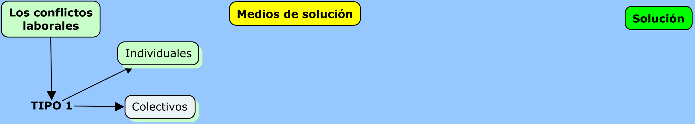
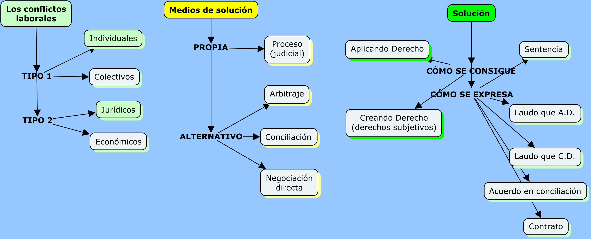

```{r setup, include=FALSE}
options(htmltools.dir.version = FALSE)
knitr::opts_chunk$set(warning = FALSE, message = FALSE, 
                      fig.retina = 3, fig.align = "center")
```

```{r xaringanExtra, echo=FALSE}
xaringanExtra::use_xaringan_extra(c("tile_view"))
xaringanExtra::use_share_again()
```

```{r, echo=FALSE}
xaringanExtra::use_webcam()
```

background-image: url(img/prim.png)
background-size: cover 

---
background-image: url(img/segu1.png)
background-size: cover 

---
background-image: url(img/terc.png)
background-size: cover 

---

class: center middle main-title section-title-4

# Audiencia de conciliación

.class-info[

.medium[**Paul Paredes**]

**Curso Taller en Proceso Laboral por Audiencias**

.light.small[CICAJ PUCP | PP99 | Poder Judicial<br>
13 de setiembre de 2022]

]

---

name: outline
class: title title-4

# Plan de la clase

--

.box-4.small[La prevalencia de la oralidad]

.box-4.small[Las reglas de conducta (en las audiencias)]

.box-4.small[La audiencia de conciliación]

.box-4.small[El saneamiento procesal]


---

layout: false
name: prevalencia
class: center middle section-title section-title-4 animated fadeIn

# La prevalencia de la oralidad

---

layout: true
class: title title-4

---

# Prevalencia de la oralidad

--

.box-4[El concepto de oralidad como técnica y como principio]

--

.box-inv-4[Oralidad como interacción simultánea de los participantes en la audiencia]

---
# Prevalencia de la oralidad

.box-4[¿Por qué la oralidad es importante?]

--

.box-4[Medio para comunicar, delimitar, conocer, esclarecer, precisar]

---
# Prevalencia de la oralidad

.box-4[Límites]

.box-inv-4[Congruencia, derecho de defensa]

--

.box-4[¿Desconectada de lo escrito?]

---

layout: false
name: conducta
class: center middle section-title section-title-4 animated fadeIn

# Las reglas de conducta (en las audiencias)

---

layout: true
class: title title-4

---

# Reglas de conducta

--

.box-4[Principio de veracidad, I TP]

--

.box-4[Fundamentos del proceso laboral, III TP]

--

.box-4[Conductas en el proceso]

--

.box-4[Consecuencias de la conducta]

---
# Reglas de conducta

--

.box-inv-4[La rebeldía, 43.1]

--

.box-inv-4[Silencio del demandado, 19, 2p]

--

.box-inv-4[Obstaculizar la actividad probatoria, 29]

--

.box-inv-4[La prueba del hecho lesivo]


---

layout: false
name: conciliacion
class: center middle section-title section-title-4 animated fadeIn

# La audiencia de conciliación
---

layout: true
class: title title-4

---

# Caso 1

.box-inv-4.small[Un trabajador después de 35 años de servicios es despedido imputándosele la comisión de una falta grave. Esta consiste en el incumplimiento de sus obligaciones de trabajo que supone el quebrantamiento de la buena fe laboral. En la audiencia de conciliación han llegado al siguiente acuerdo:]

.box-inv-4.small[1.El extrabajador se compromete a desistirse de la pretensión y declarar que no tiene nada que reclamar a su exempleador.]

.box-inv-4.small[2.A cambio, el exempleador se compromete a contratar en ese mismo momento al hijo menor del demandante (su extrabajador).]

???

.box-inv-4.small[Un trabajador después de 35 años de servicios es despedido imputándosele la comisión de una falta grave. Esta consiste en el incumplimiento de sus obligaciones de trabajo que supone el quebrantamiento de la buena fe laboral. El trabajador entra en contacto con su exempleador y luego de varias reuniones han llegado al siguiente acuerdo:]

.box-inv-4.small[1.El trabajador (extrabajador) se compromete a no interponer ninguna demanda y, en caso que la hubiese interpuesto, se compromete a desistirse de la pretensión. Declara que no tiene nada que reclamar a su empleador.]

.box-inv-4.small[2.A cambio, el empleador se compromete --y cumple-- a contratar al hijo menor de su extrabajador.]

---

# Caso 2

.box-inv-4.small[Un trabajador después de más de 10 años de servicios reclama el pago de sus beneficios sociales a su empleador. Nunca le entregó recibo, ni boletas, pero cada fin de mes le pagaba el monto acordado: S/1,000.00. El extrabajador solicita el pago de las gratificaciones legales, asignación familiar, CTS y, en general, los beneficios que por ley corresponden a los trabajadores sujetos a la actividad privada. El exempleador tiene la voluntad de llegar a un acuerdo. Uno de los puntos de discusión es la fecha de inicio, pues desde esa fecha empezaría el reconocimiento de los derechos. Luego del intercambio de pareceres las partes llegan al siguiente acuerdo:]

.box-inv-4.small[1.Considerar como fecha de ingreso el 1 de julio de 2015. 2. Calcular los beneficios de ley considerando la suma de S/1,000.00. 3. Pagar la suma que arroje dicho cálculo en el plazo de 3 días hábiles.]

---

# Caso 3

.box-inv-4.small[Francisco es contratado por una municipalidad para prestar el servicio de seguridad interna. La municipalidad le paga la suma de S/1,500.00 y él, a cambio, debe entregarle un recibo por honorarios. La municipalidad le provee de uniforme. La municipalidad, después de 4 años, ha decidido no renovarle el contrato. Francisco ha demandado la reposición como trabajador obrero de la municipalidad. Luego del intercambio de pareceres las partes han llegado al siguiente acuerdo:]

.box-inv-4.small[1.Reponer al demandante en el puesto de jardinero bajo contrato CAS con un plazo de vigencia de un año contado desde la fecha del acuerdo.]


???


Caso 3

.box-inv-4.small[Juan tiene en su contrato de trabajo una cláusula en la cual se indica que el empleador se compromete a brindar todas las facilidades que resulten necesarias para la adecuada prestación del servicio, incluyendo facilidades para el traslado a su centro de trabajo. Juan se acaba de comprar un automóvil último modelo. Juan piensa que su empleador debe darle un espacio para estacionar su moderno vehículo o, en todo caso, pagarle la cochera. Su empleador le acaba de responder que "ni hablar, de ninguna manera".]

.box-inv-4.small[Juan ha interpuesto una demanda requiriendo a su empleador 1. la asignación de una plaza en la playa de estacionamiento de la empresa o, alternativamente, asuma el costo del estacionamiento en una playa comercial cercana al lugar de trabajo. Asimismo, ha demandado el monto pagado por estacionamiento desde la fecha del reclamo a su empleador.]

Caso 4

.box-inv-4.normal[Lo mismo que el caso 3 pero la cláusula no está contenida en el contrato de trabajo sino en el convenio colectivo del año 1998.]


Caso 5

.box-inv-4.small[[Asuma que el caso se da antes de la Ley 31047] Andrés está sujeto al régimen laboral del trabajo doméstico. Su remuneración mensual es de S/200.00. Andrés cree que debe ganar S/930.00 pero le siguen pagando S/200.00. ¿Andrés debería reclamar? ¿Qué le aconsejaría usted?]


Caso 6

.box-inv-4[En la sección de "Acabados" trabajan 27 operarios en un espacio de poco más de 50 m<sup>2</sup>. Hace mucho calor, incluso en invierno. Los trabajadores han solicitado que la empresa coloque aire acondicionado pero les han contestado que no están obligados a ello. El sindicato piensa incluir dicho punto en el próximo pliego de reclamos. ¿Qué les diría usted?]

---

# Conflictos, medios y solución

&nbsp;


---

# Los conflictos laborales



---

# Los conflictos laborales


---

# Medios de solución


---

# Medios de solución


---

# Solución


---

# Solución



---

layout: false
name: dostesis
class: center middle section-title section-title-4 animated fadeIn

# Dos tesis sobre la conciliación en los procesos laborales

---

layout: true
class: title title-4

---

# La conciliación

.box-4[Conciliación]

.box-inv-4.small[Es un mecanismo para resolver un conflicto de intereses]

--

.box-4.sp-after.small[
¿De qué manera se resuelve un conflicto en conciliación?
]

--

.box-inv-4.sp-after.small[
+ Mediante el acuerdo:: llegando a un acuerdo
]

.box-4.small[Es el acuerdo lo que pone fin al conflicto] 

.box-4.small[Es el acuerdo el modo de resolver el conflicto]


---

# Conciliación

.box-4[¿Ese acuerdo tiene algún parámetro de validez?]

.box-inv-4[**Tesis 1 - A**]

.box-4.small[A. El derecho :: derechos disponibles de las partes]

.center.float-left[.box-inv-4.small[NLPT] .box-inv-4.small[30 a)] .box-inv-4.small[Derechos disponibles]]

.center.float-left[.box-inv-4.small[TUO LRPCA] .box-inv-4.small[42] .box-inv-4.small[Derechos disponibles]]

.center.float-left[.box-inv-4.small[D.Leg.1070] .box-inv-4.small[7] .box-inv-4.small[Derechos disponibles]]

.box-4.smaller[Entonces, solo los derechos laborales disponibles serían susceptibles de conciliar]


???

.box-inv-4.smaller[(D. Leg. 1070) Artículo 7.- Materias conciliables]

.box-inv-4.smaller[Son materia de conciliación las pretensiones determinadas o determinables que versen sobre derechos disponibles de las partes.]


---

# Conciliación

.box-4[¿Ese acuerdo tiene algún parámetro de validez?]

.box-inv-4[**Tesis 1 - B**]

.box-4.small[B. Los hechos :: la verdad como correspondencia]


???

Criterios de verdad

.box-4.small[Los hechos :: la verdad como correspondencia]

.box-inv-4.sp-after.smaller[

+ Verdad como correspondencia con la realidad: `"La afirmación 'La Tierra es plana' es V/F porque hay suficientes elementos de corroboración de lo afirmado".`
]

.box-inv-4.sp-after.smaller[

+ Verdad como consenso: acuerdo: `"Todos (la mayoría, algunos, alguien) acordamos que 'La Tierra es plana'."` 

+ Los motivos del acuerdo pueden ser las creencias, la conveniencia, la utilidad, etc.
]

.box-inv-4.smaller[

+ Verdad como persuasión: victoria en el ánimo, en la conciencia del decisor: `"Tengo la convicción, la certeza, de que 'la Tierra es plana'."`
]

---

# Conciliación

.box-4[¿Ese acuerdo tiene algún parámetro de validez?]

.box-inv-4[**Tesis 2**]

.box-4[El principio dispositivo]

.center.float-left[.box-inv-4[Iniciativa de parte] .box-inv-4[Según lo alegado y probado]]

.center[

> *Yo soy dueño de mis conflictos*

> *Yo los propongo, yo los concluyo*
]
---

layout: false
name: nlptyconciliacion
class: center middle section-title section-title-4 animated fadeIn

# La conciliación en la NLPT

---

layout: true
class: title title-4

---

# La NLPT y la conciliación

.box-4.medium[Características del acuerdo en conciliación:]

.box-inv-4.less-medium[Libre - Adoptado por el titular del derecho]

.box-inv-4.less-medium[Informado - Con participación del abogado del prestador de servicios demandante]

.box-inv-4.less-medium[De buena fe - Fundamento del proceso laboral]

???

El arbitraje jurídico laboral

+ Es un mecanismo para resolver un conflicto de intereses.

+ ¿De qué manera se resuelve un conflicto jurídico en arbitraje?

+ Aplicando derecho


El arbitraje jurídico

.box-inv-4.small[+ Parámetros de validez del acuerdo de someter el conflicto a arbitraje jurídico

El derecho :: derechos disponibles de las partes y aquellas que la ley autorice
]

.small[
 > (D. Leg. 1071) Artículo 2.- Materias susceptibles de arbitraje.

 > 1. Pueden someterse a arbitraje las controversias sobre materias de libre disposición conforme a derecho, así como aquellas que la ley o los tratados o acuerdos internacionales autoricen.
]

.box-inv-4.small[Entonces, solo los derechos laborales disponibles serían susceptibles de llevar a arbitraje. + Pero también podría sostenerse que `lo laboral` es una materia autorizada por ley.]


El arbitraje jurídico

+ Parámetros de validez del acuerdo de someter el conflicto a arbitraje jurídico

 > (NLPT. Disp. Complem.) SEXTA.- Las controversias jurídicas en materia laboral pueden ser sometidas a arbitraje, siempre y cuando el convenio arbitral se inserte a la conclusión de la relación laboral y, adicionalmente, la remuneración mensual percibida sea, o haya sido, superior a las setenta (70) Unidades de Referencia Procesal (URP).


El arbitraje jurídico

.box-4[Debe cumplir 2 condiciones:]

.box-inv-4[1.El convenio arbitral solo puede pactarse a la conclusión de la relación laboral]

.box-inv-4[2.La remuneración mensual percibida debe haber sido mayor a 70 URP (en 2021 > S/30,800)]


La NLPT y el arbitraje jurídico

.box-4.medium[Características del acuerdo que somete el conflicto a arbitraje jurídico:]

.box-inv-4.medium[Libre]

.box-inv-4.medium[Con garantía de solvencia]

.box-inv-4.medium[De buena fe]


---

# ¿Cuál es la función del proceso?

.box-inv-4.sp-after.smaller[

+ El proceso como instancia de .white[construcción de una realidad para persuadir al juzgador.]
]

.box-inv-4.sp-after.smaller[

+ El proceso como mero mecanismo de resolución de controversias antes que como medio de .white[actuación del derecho.]
]

.box-4.small[
+ El proceso como un .naranja[mecanismo de solución de conflictos donde se aplica el derecho vigente en un país sobre los hechos sucedidos] (decir derecho,aplicar derecho) antes que como mera instancia de resolución de controversias.
]

???

Comparación (1)

<style type="text/css">
.tg  {border-collapse:collapse;border-spacing:0;}
.tg td{border-color:black;border-style:solid;border-width:1px;font-family:Arial, sans-serif;font-size:14px;
  overflow:hidden;padding:10px 5px;word-break:normal;}
.tg th{border-color:black;border-style:solid;border-width:1px;font-family:Arial, sans-serif;font-size:14px;
  font-weight:normal;overflow:hidden;padding:10px 5px;word-break:normal;}
.tg .tg-umkb{background-color:#67fd9a;border-color:#000000;font-family:Georgia, serif !important;;font-size:16px;text-align:left;
  vertical-align:top}
.tg .tg-10x8{background-color:#c0c0c0;border-color:#000000;font-family:Georgia, serif !important;;font-size:16px;font-weight:bold;
  text-align:left;vertical-align:top}
.tg .tg-bhpe{background-color:#67fd9a;border-color:#000000;font-family:Georgia, serif !important;;font-size:16px;font-weight:bold;
  text-align:center;vertical-align:top}
.tg .tg-3245{border-color:#000000;font-family:Georgia, serif !important;;font-size:16px;text-align:left;vertical-align:top}
.tg .tg-k6mb{border-color:#000000;font-family:Georgia, serif !important;;font-size:16px;text-align:center;vertical-align:top}
</style>
<table class="tg">
<thead>
  <tr>
    <th class="tg-umkb"></th>
    <th class="tg-bhpe">Conflicto jurídico</th>
    <th class="tg-bhpe">Conflicto económico</th>
  </tr>
</thead>
<tbody>
  <tr>
    <td class="tg-10x8">Origen</td>
    <td class="tg-3245">Un conflicto, una insatisfacción</td>
    <td class="tg-3245">Un conflicto, una insatisfacción</td>
  </tr>
  <tr>
    <td class="tg-10x8">¿Cómo resolverlo?</td>
    <td class="tg-3245">Aplicando derecho:<br>ello supone que existe una norma que contiene la solución,<br>entonces, lo que se pide es aplicar la norma, o,<br>interpretarla del modo como se pretende</td>
    <td class="tg-3245">Creando derecho:<br>ello supone que no existe la norma que contiene la solución,<br>o que la que existe es insuficiente (vaga, ambigua),<br>o para garantizar mejor un derecho</td>
  </tr>
  <tr>
    <td class="tg-10x8">Medio típico de aplicación de derecho</td>
    <td class="tg-3245">La sentencia</td>
    <td class="tg-k6mb">---</td>
  </tr>
  <tr>
    <td class="tg-10x8">Medio típico de creación de derecho</td>
    <td class="tg-k6mb">---</td>
    <td class="tg-3245">El acuerdo contractual,<br>El consenso legislativo,<br>El convenio colectivo</td>
  </tr>
  <tr>
    <td class="tg-10x8">Vía típica de canalización</td>
    <td class="tg-3245">El proceso (judicial)</td>
    <td class="tg-3245">El procedimiento legislativo<br>La negociación<br>La conciliación<br>La negociación colectiva</td>
  </tr>
</tbody>
</table>


Comparación (2)

<style type="text/css">
.tg  {border-collapse:collapse;border-spacing:0;}
.tg td{border-color:black;border-style:solid;border-width:1px;font-family:Arial, sans-serif;font-size:14px;
  overflow:hidden;padding:10px 5px;word-break:normal;}
.tg th{border-color:black;border-style:solid;border-width:1px;font-family:Arial, sans-serif;font-size:14px;
  font-weight:normal;overflow:hidden;padding:10px 5px;word-break:normal;}
.tg .tg-umkb{background-color:#EA7177;border-color:#000000;font-family:Georgia, serif !important;;font-size:16px;text-align:left;
  vertical-align:top}
.tg .tg-10x8{background-color:#c0c0c0;border-color:#000000;font-family:Georgia, serif !important;;font-size:16px;font-weight:bold;
  text-align:left;vertical-align:top}
.tg .tg-bhpe{background-color:#EA7177;border-color:#000000;font-family:Georgia, serif !important;;font-size:16px;font-weight:bold;
  text-align:center;vertical-align:top}
.tg .tg-3245{border-color:#000000;font-family:Georgia, serif !important;;font-size:16px;text-align:left;vertical-align:top}
</style>
<table class="tg">
<thead>
  <tr>
    <th class="tg-umkb"></th>
    <th class="tg-bhpe">Conflicto jurídico</th>
    <th class="tg-bhpe">Conflicto económico</th>
  </tr>
</thead>
<tbody>
  <tr>
    <td class="tg-10x8">Vías alternativas</td>
    <td class="tg-3245">La conciliación<br>La mediación<br>El arbitraje</td>
    <td class="tg-3245">La conciliación<br>La mediación<br>El arbitraje<br>La huelga</td>
  </tr>
  <tr>
    <td class="tg-10x8">Acto de presentación (postulación)</td>
    <td class="tg-3245">La demanda</td>
    <td class="tg-3245">La propuesta legislativa<br>La propuesta contractual<br>El pliego de reclamos</td>
  </tr>
  <tr>
    <td class="tg-10x8">Resultado o producto</td>
    <td class="tg-3245">La sentencia<br>El acuerdo en conciliación*<br>La transacción*<br>El laudo arbitral jurídico</td>
    <td class="tg-3245">La ley<br>El contrato<br>El acuerdo en conciliación<br>El laudo arbitral económico</td>
  </tr>
  <tr>
    <td class="tg-10x8">Consecuencia respecto del resultado</td>
    <td class="tg-3245">Se cumple.<br>Si no: proceso de ejecución</td>
    <td class="tg-3245">Se cumple.<br>Si no: proceso de conocimiento</td>
  </tr>
</tbody>
</table>

---

layout: false
class: center middle section-title section-title-4 animated fadeIn

# El juzgamiento anticipado y la rebeldía

---

layout: true
class: title title-4

---
# Razones subyacentes

.box-inv-4.sp-after.small[
Importancia de la conciliación en el modelo de la NLPT
]

.box-inv-4.sp-after.small[
No son dos audiencias *obligatorias*
]

.box-inv-4.sp-after.small[
Incentivos que modulan la conducta hacia el acuerdo
]

.center.float-left[
.box-4[Juzgamiento anticipado]
.box-4[Rebeldía]
.box-4[-->]
.box-4[Aud. conciliación]
]

.box-4[La aud. conciliación como única audiencia]

.center.float-left[
.box-inv-4.small[Única porque hubo acuerdo]
.box-inv-4.small[Única porque hubo juzgamiento anticipado]
]

---

# Razones subyacentes

.box-4.small[1.Una justicia oportuna]

.box-4.small[2.Funcionalidad del proceso]

.center.float-left[.box-inv-4[]
.box-inv-4[Hechos admitidos]
.box-inv-4[Hechos necesitados de prueba]
.box-inv-4[Conducta procesal]
.box-inv-4[Presunción relativa de verdad de la demanda]
]

---
# Dos modalidades de juzg. anticipado

.box-4.small[Primera modalidad]

.box-inv-4.smaller[
Segundo párrafo del inciso 2 del artículo 43°:
]

.smaller[
> «Por decisión de las partes la conciliación puede prolongarse lo necesario hasta que se dé por agotada, pudiendo incluso continuar los días hábiles siguientes, cuantas veces sea necesario, en un lapso no mayor de un (1) mes. Si las partes acuerdan la solución parcial o total de su conflicto el juez, en el acto, aprueba lo acordado con efecto de cosa juzgada; asimismo, ordena el cumplimiento de las prestaciones acordadas en el plazo establecido por las partes o, en su defecto, en el plazo de cinco (5) días hábiles siguientes. **Del mismo modo, si algún extremo no es controvertido, el juez emite resolución con calidad de cosa juzgada ordenando su pago en igual plazo.**»
]

---
# Dos modalidades de juzg. anticipado

.box-4.small[Segunda modalidad]

.box-inv-4.smaller[
Segundo párrafo del inciso 3 del artículo 43°:
]

.smaller[
> «Si el juez advierte, haya habido o no contestación, que la cuestión debatida es solo de derecho, o que siendo también de hecho no hay necesidad de actuar medio probatorio alguno, solicita a los abogados presentes exponer sus alegatos, a cuyo término, o en un lapso no mayor de sesenta (60) minutos, dicta el fallo de su sentencia. La notificación de la sentencia se realiza de igual modo a lo regulado para el caso de la sentencia dictada en la audiencia de juzgamiento.»
]

.box-inv-4.small[Esta modalidad no depende de la rebeldía. La rebeldía es solo un subtipo desencadenante del juzgamiento anticipado]

---
# JA: segunda modalidad

.box-4[Supuestos]

.box-inv-4[Cuando la causa es solo de derecho]

.box-inv-4[Cuando siendo de hecho no existe necesidad de actuar medio probatorio alguno. Ver art. 46*.]

.box-inv-5.small[*Hechos admitidos, presumidos por ley, notorios y recogidos en resolución con calidad de cosa juzgada]

.box-inv-5.small[**No es determinante del JA si se contestó o no la demanda]

---
# Rebeldía

.center.float-left[
.box-inv-4[Significado del silencio]
.box-inv-4[Conductas no colaborativas del demandado]
]

.box-4.sp-after[
Segundo párrafo del artículo 19°:
]

.box-4[
«Si el demandado no niega expresamente los hechos expuestos en la demanda, estos son considerados admitidos».
]

---
# Rebeldía

.box-4[Primera idea: ¿sanción?]

.small[
> .box-inv-4[(...), cuando el demandado no contesta o no asiste a la audiencia de conciliación o no cumple con el requisito de acudir con poderes suficientes para conciliar, el sistema asume que expresa su conformidad sobre los hechos de la demanda a fin de precluir con la etapa de la contestación, avanzar a las siguientes y cumplir su finalidad de solución de los conflictos.

P. Paredes. Base doctrinal del juzgamiento anticipado, p. 6.
]]

---
# Rebeldía

.box-4[Segunda idea: conducta voluntaria de la parte]

.box-inv-4[Verificar el emplazamiento al demandado]

.box-4[Tercera idea: en el PAL el JA carece de mayor utilidad práctica, aunque la rebeldía generaría que los hechos se reputen admitidos]

---
# Rebeldía y juzgamiento anticipado

&nbsp;

&nbsp;

.box-4.medium[Tres escenarios:]

---
# Rebeldía y juzgamiento anticipado

.box-4[Uno]

.float-left[
+ .box-4.small[Si demandado no asiste, entonces, no contesta la demanda.]

+ .box-4.small[Si no contesta la demanda, no niega expresamente los hechos de la demanda.]

+ .box-4.small[Entonces, los hechos de la demanda son hechos admitidos y no se requiere la actuación de medios probatorios.]
]

---
# Rebeldía y juzgamiento anticipado

.box-4[Dos]

.float-left[
+ .box-4.small[Si demandado asiste, se apersona, pero no contesta la demanda.]
+ .box-4.small[Si no contesta la demanda, no niega expresamente los hechos de la demanda.]
+ .box-4.small[Entonces, los hechos de la demanda son hechos admitidos y no se requiere la actuación de medios probatorios.]
]

---
# Rebeldía y juzgamiento anticipado

.box-4[Tres]

.float-left[
+ .box-4.small[Si demandado asiste, se apersona, (formalmente) contesta la demanda, pero no tiene poderes suficientes para conciliar.]
+ .box-4.small[Si no tiene poderes suficientes para conciliar se incumple con un requisito de la contestación.]
+ .box-4.small[Si se incumple con un requisito de la contestación, se tiene por no contestada.]
+ .box-4.small[Si no contesta la demanda, no niega expresamente los hechos de la demanda.]
+ .box-4.small[Entonces, los hechos de la demanda son hechos admitidos y no se requiere la actuación de medios probatorios.]
]

???

Rebeldía y dirección del juez

.box-inv-4[
+ Si juez no aplica el JA sería porque ha visto los MP y que considere que 1. contradicen la demanda o 2 no la sustentan.
]

---

layout: false
name: saneamiento
class: center middle section-title section-title-4 animated fadeIn

# El saneamiento procesal
---

layout: true
class: title title-4

---

# Saneamiento procesal

--

.box-4[Demanda y Contestación]

--

.box-inv-4[Presupuestos procesales y condiciones de la acción]

--

.box-inv-4[Prevalencia del fondo sobre la forma]

--

.box-inv-4[Interpretación a favor continuidad del proceso]

--

.box-inv-4[Nulidad de los actos procesales]

--

.box-inv-4[Pretensiones::Congruencia]

---

layout: false
name: audiencias
class: center middle section-title section-title-4 animated fadeIn

# Los procesos laborales

---

layout: true
class: title title-4

---
# Los tipos de procesos EN la NLPT

.box-4[El proceso ordinario laboral]

.box-inv-4[El proceso abreviado laboral]

.box-5[El proceso impugnativo de laudos arbitrales económicos]

.box-inv-5[El proceso cautelar]

.box-6[El proceso de ejecución]

.box-inv-6[Los procesos no contenciosos]

---
# Los tipos de procesos FUERA de la NLPT

.box-1[El proceso contencioso administrativo (D.S. 011-2019-JUS)]

.box-inv-1[El proceso de acción popular (CPConst.)]

.box-2[El proceso de anulación de laudo jurídico (D.Leg. 1071)]

.box-inv-2[El proceso de acción de amparo (CPConst.)]

.box-3[El proceso de inconstitucionalidad (CPConst.)]

.box-inv-3[El proceso de cumplimiento (CPConst.)]

---
# El proceso ordinario laboral

.box-4[1.Audiencia de conciliación]

.box-inv-4.small[El juez tiene una participación activa en la solución de las diferencias.]

.box-inv-4.small[La conciliación puede prolongarse lo necesario por decisión de las partes.]

.box-inv-4.small[El juez aprueba el acuerdo parcial o total, y también sobre los extremos no controvertidos, con calidad de cosa juzgada y ordena el cumplimiento de lo acordado.]

.box-inv-4.small[Los extremos no solucionados pasan a ser materia de juicio.]

.box-inv-4.small[El juez emite sentencia al finalizar la audiencia si la causa es de puro derecho o no hay necesidad de actuación probatoria (**juzgamiento anticipado**).]

---
# El proceso ordinario laboral

.box-4[2.Audiencia de juzgamiento]

.box-4.small[Incorpora las etapas de:]

.box-inv-4.small[**Confrontación de posiciones:** exposición de los argumentos de demandante y demandado.]

.box-inv-4.small[**Actuación probatoria:** actuación de todos los medios probatorios sólo de los hechos necesitados de prueba.]

.box-inv-4.small[**Alegatos:** argumentación de cierre de los abogados.]

.box-inv-4.small[**Sentencia:** a la conclusión de la audiencia o luego de 60 minutos. Excepcionalmente, dentro de 5 días hábiles siguientes.]

---

layout: false

background-image: url(https://raw.githubusercontent.com/PaulParedes/materiales/master/pol1.png)
background-size: contain


---

background-image: url(https://raw.githubusercontent.com/PaulParedes/materiales/master/pol2.png)
background-size: contain

---

layout: true
class: title title-4

---
# El proceso abreviado laboral

.box-4[Audiencia Única]

.box-4.smaller[Se estructura sobre la base de las audiencias de conciliación y de juzgamiento del proceso ordinario laboral.]

.box-4.smaller[Incorpora las etapas de:]

.box-inv-4.small[Conciliación]

.box-inv-4.small[Confrontación de posiciones]

.box-inv-4.small[Actuación probatoria]

.box-inv-4.small[Alegatos]

.box-inv-4.small[Sentencia]

---
layout: false

background-image: url(https://raw.githubusercontent.com/PaulParedes/materiales/master/pal.png)
background-size: contain

---
class: center middle section-title section-title-4 animated fadeIn

# Presupuestos procesales y condiciones de la acción

---

layout: true
class: title title-4

---

# Presupuestos procesales

## Para la existencia de una relación procesal válida


---
# Condiciones de la acción

## Presupuestos para la emisión de una decisión de fondo


---

layout: false
name: pretensiones
class: center middle section-title section-title-4 animated fadeIn

# Competencia (materia [tipo de relación], cuantía, grado, territorio)

---

layout: true
class: title title-4

---

# ¿Cuáles pretensiones?

--

.box-4.normal[Respuesta 1: (materia*)]

.box-inv-4.normal[Las pretensiones que están listadas en el artículo 2 de la NLPT, sin ser exclusivas.]

---
# ¿Cuáles pretensiones?

.box-4.normal[Las pretensiones relacionadas a los siguientes aspectos o temas:]

.box-inv-4.small[a) El nacimiento, desarrollo y extinción de la prestación personal de servicios; así como a los correspondientes actos jurídicos.]

.box-inv-4.small[b) La responsabilidad por daño patrimonial o extrapatrimonial, incurrida por cualquiera de las partes involucradas en la prestación personal de servicios, o terceros en cuyo favor se presta o prestó el servicio.]

.box-inv-4.small[c) Los actos de discriminación en el acceso, ejecución y extinción de la relación laboral.]

---
# ¿Cuáles pretensiones?

.box-inv-4.small[d) El cese de los actos de hostilidad del empleador, incluidos los actos de acoso moral y hostigamiento sexual, conforme a la ley de la materia.]

.box-inv-4.small[e) Las enfermedades profesionales y los accidentes de trabajo.]

.box-inv-4.small[f) La impugnación de los reglamentos internos de trabajo.]

.box-inv-4.small[g) Los conflictos vinculados a una organización sindical y entre organizaciones sindicales, incluida su disolución.]

---
# ¿Cuáles pretensiones?

.box-inv-4.small[h) El cumplimiento de obligaciones generadas o contraídas con ocasión de la prestación personal de servicios exigibles a institutos, fondos, cajas u otros.]

.box-inv-4.small[i) El cumplimiento de las prestaciones de salud y pensiones de invalidez, a favor de los asegurados o los beneficiarios, exigibles al empleador, a las entidades prestadoras de salud o a las aseguradoras.]

.box-inv-4.small[j) El Sistema Privado de Pensiones.]

.box-inv-4.small[k) La nulidad de cosa juzgada fraudulenta laboral.]

.box-inv-4.small[l) **(OTROS)**]

---
class: animated, fadeIn

# Ámbito de la justicia laboral

.box-inv-4.normal[Se aplica a TODO conflicto jurídico derivado de una prestación personal de servicios remunerada:]

--

<style type="text/css">
.tg  {border-collapse:collapse;border-spacing:0;}
.tg td{border-color:black;border-style:solid;border-width:1px;font-family:Arial, sans-serif;font-size:14px;
  overflow:hidden;padding:10px 5px;word-break:normal;}
.tg th{border-color:black;border-style:solid;border-width:1px;font-family:Arial, sans-serif;font-size:14px;
  font-weight:normal;overflow:hidden;padding:10px 5px;word-break:normal;}
.tg .tg-gure{background-color:#9aff99;border-color:inherit;font-family:Georgia, serif !important;;font-size:20px;text-align:left;
  vertical-align:top}
.tg .tg-yd3j{border-color:inherit;font-family:Georgia, serif !important;;font-size:20px;text-align:left;vertical-align:top}
</style>
<table class="tg">
<thead>
  <tr>
    <th class="tg-gure">De naturaleza</th>
    <th class="tg-gure">Sobre derechos</th>
    <th class="tg-gure">Respecto de temas</th>
    <th class="tg-gure">Ocurridos</th>
  </tr>
</thead>
<tbody>
  <tr>
    <td class="tg-yd3j"><span style="color:#000">Laboral</span><br><br><span style="color:#000">Formativa</span><br><br><span style="color:#000">Cooperativista</span><br><br><span style="color:#000">Administrativa</span></td>
    <td class="tg-yd3j"><span style="color:#000">Individuales</span><br><br><span style="color:#000">Plurales</span><br><br><span style="color:#000">Colectivos</span></td>
    <td class="tg-yd3j"><span style="color:#000">Sustanciales</span><br><br><span style="color:#000">Conexos</span></td>
    <td class="tg-yd3j"><span style="color:#000">Antes</span><br><br><span style="color:#000">Durante</span><br><br><span style="color:#000">Después</span></td>
  </tr>
</tbody>
</table>

---
# ¿Cuáles pretensiones?

.box-4.normal[Respuesta 2: (tipo de relación)]

.box-inv-4.normal[Todas las pretensiones relativas a cualquiera de los 4 tipos de relaciones considerados: laboral, formativa, cooperativista y administrativa.
]

---
# Lugar geográfico 

## Competencia por territorio

<style type="text/css">
.tg  {border-collapse:collapse;border-spacing:0;}
.tg td{border-color:black;border-style:solid;border-width:1px;font-family:Arial, sans-serif;font-size:14px;
  overflow:hidden;padding:10px 5px;word-break:normal;}
.tg th{border-color:black;border-style:solid;border-width:1px;font-family:Arial, sans-serif;font-size:14px;
  font-weight:normal;overflow:hidden;padding:10px 5px;word-break:normal;}
.tg .tg-6c8b{font-family:Georgia, serif !important;;font-size:20px;text-align:left;vertical-align:top}
.tg .tg-a9uw{background-color:#EA7177;font-family:Georgia, serif !important;;font-size:20px;text-align:left;vertical-align:top}
</style>
<table class="tg">
<thead>
  <tr>
    <th class="tg-a9uw"><span style="font-weight:bold;color:#000">Regla, a elección del demandante</span></th>
    <th class="tg-a9uw"><span style="font-weight:bold;color:#000">Si la demanda es dirigida contra quien prestó los servicios</span></th>
    <th class="tg-a9uw"><span style="font-weight:bold;color:#000">En el caso de  impugnación de laudos arbitrales económicos</span></th>
  </tr>
</thead>
<tbody>
  <tr>
    <td class="tg-6c8b"><span style="color:#000">El juez del lugar del domicilio principal del demandado, o,</span><br><br><span style="color:#000">El juez del último lugar donde se prestaron los servicios</span></td>
    <td class="tg-6c8b"><span style="color:#000">Solo es competente el juez del domicilio del prestador de servicios</span></td>
    <td class="tg-6c8b"><span style="color:#000">Solo es competente la sala laboral del lugar donde se expidió el laudo</span></td>
  </tr>
</tbody>
</table>


<br/>

***

###### La competencia por razón de territorio solo puede ser prorrogada cuando resulte a favor del prestador de servicios.

---
# Órgano jurisdiccional 

## Juzgados especializados de trabajo

<style type="text/css">
.tg  {border-collapse:collapse;border-spacing:0;}
.tg td{border-color:black;border-style:solid;border-width:1px;font-family:Arial, sans-serif;font-size:14px;
  overflow:hidden;padding:10px 5px;word-break:normal;}
.tg th{border-color:black;border-style:solid;border-width:1px;font-family:Arial, sans-serif;font-size:14px;
  font-weight:normal;overflow:hidden;padding:10px 5px;word-break:normal;}
.tg .tg-6c8b{font-family:Georgia, serif !important;;font-size:20px;text-align:left;vertical-align:top}
.tg .tg-a9uw{background-color:#9aff99;font-family:Georgia, serif !important;;font-size:20px;text-align:left;vertical-align:top}
</style>
<table class="tg">
<thead>
  <tr>
    <th class="tg-a9uw"><span style="font-weight:bold;color:#000">En proceso ordinario laboral</span></th>
    <th class="tg-a9uw"><span style="font-weight:bold;color:#000">En proceso abreviado laboral</span></th>
    <th class="tg-a9uw"><span style="font-weight:bold;color:#000">En proceso contencioso administrativo</span></th>
    <th class="tg-a9uw"><span style="font-weight:bold;color:#000">En proceso de ejecución</span></th>
  </tr>
</thead>
<tbody>
  <tr>
    <td class="tg-6c8b"><span style="color:#000">Todo conflicto jurídico de naturaleza laboral, formativa o cooperativista, </span><span style="font-weight:bold;color:#000">mayor 50 URP o sin expresión monetaria</span><br><br><span style="color:#000">El listado de materias es meramente ilustrativo</span></td>
    <td class="tg-6c8b"><span style="color:#000">Reposición, cuando se plantea como pretensión principal única</span><br><br><span style="color:#000">Pretensiones relativas a la vulneración de la libertad sindical</span></td>
    <td class="tg-6c8b"><span style="color:#000">Todo conflicto jurídico de naturaleza laboral, administrativa o de seguridad social, de derecho público</span><br><br><span style="color:#000">Impugnación de actuaciones de la AAT</span></td>
    <td class="tg-6c8b"><span style="color:#000">Títulos ejecutivos mayor a 50 URP</span></td>
  </tr>
</tbody>
</table>

---
# Órgano jurisdiccional 

## Juzgados de paz letrados laborales

<style type="text/css">
.tg  {border-collapse:collapse;border-spacing:0;}
.tg td{border-color:black;border-style:solid;border-width:1px;font-family:Arial, sans-serif;font-size:14px;
  overflow:hidden;padding:10px 5px;word-break:normal;}
.tg th{border-color:black;border-style:solid;border-width:1px;font-family:Arial, sans-serif;font-size:14px;
  font-weight:normal;overflow:hidden;padding:10px 5px;word-break:normal;}
.tg .tg-e904{font-family:Georgia, serif !important;;font-size:20px;text-align:left;vertical-align:top}
.tg .tg-jtsx{background-color:#9aff99;font-family:Georgia, serif !important;;font-size:20px;text-align:left;vertical-align:top}
</style>
<table class="tg">
<thead>
  <tr>
    <th class="tg-jtsx"><span style="font-weight:bold;color:#000">En proceso abreviado laboral</span></th>
    <th class="tg-jtsx"><span style="font-weight:bold;color:#000">En proceso de ejecución</span></th>
    <th class="tg-jtsx"><span style="font-weight:bold;color:#000">Procesos no contenciosos</span></th>
  </tr>
</thead>
<tbody>
  <tr>
    <td class="tg-e904"><span style="color:#000">Las pretensiones:</span><br><br><span style="color:#000">. atribuidas originalmente a los Juzgados de Trabajo,</span><br><br><span style="color:#000">1. que sean obligaciones de dar, </span><span style="text-decoration:underline;color:#000">y</span><br><br><span style="color:#000">2. hasta 50 URP</span></td>
    <td class="tg-e904"><span style="color:#000">Títulos ejecutivos hasta 50 URP</span><br><br><span style="color:#000">Cobranza de aportes previsionales del sistema privado de pensiones retenidos por el empleador, sin importar la cuantía</span></td>
    <td class="tg-e904"><span style="color:#000">Todos los asuntos no contenciosos, sin importar la cuantía</span></td>
  </tr>
</tbody>
</table>

---
# Órgano jurisdiccional

## Salas laborales superiores


<style type="text/css">
.tg  {border-collapse:collapse;border-spacing:0;}
.tg td{border-color:black;border-style:solid;border-width:1px;font-family:Arial, sans-serif;font-size:14px;
  overflow:hidden;padding:10px 5px;word-break:normal;}
.tg th{border-color:black;border-style:solid;border-width:1px;font-family:Arial, sans-serif;font-size:14px;
  font-weight:normal;overflow:hidden;padding:10px 5px;word-break:normal;}
.tg .tg-67cq{border-color:inherit;font-family:Georgia, serif !important;;font-size:20px;text-align:left;vertical-align:top}
.tg .tg-sbdv{background-color:#9aff99;border-color:inherit;font-family:Georgia, serif !important;;font-size:20px;text-align:left;
  vertical-align:top}
</style>
<table class="tg">
<thead>
  <tr>
    <th class="tg-sbdv"><span style="font-weight:bold;color:#000">En proceso de acción popular</span></th>
    <th class="tg-sbdv"><span style="font-weight:bold;color:#000">En proceso de anulación de laudo arbitral jurídico</span></th>
    <th class="tg-sbdv"><span style="font-weight:bold;color:#000">En proceso impugnativo de laudos arbitrales económicos</span></th>
  </tr>
</thead>
<tbody>
  <tr>
    <td class="tg-67cq"><span style="color:#000">La acción popular en materia laboral, conforme a las reglas del Código Procesal Constitucional</span></td>
    <td class="tg-67cq"><span style="color:#000">La anulación de laudo que resuelve un conflicto jurídico de naturaleza laboral, conforme a las reglas de la Ley de Arbitraje</span></td>
    <td class="tg-67cq"><span style="color:#000">Impugnación de laudos arbitrales derivados de una negociación colectiva</span></td>
  </tr>
  <tr>
    <td class="tg-67cq" colspan="3">* También conocen las contiendas de competencia y los conflictos de autoridad</td>
  </tr>
</tbody>
</table>

---

layout: false
name: capacidad
class: center middle section-title section-title-4 animated fadeIn

# Capacidad procesal

---

layout: true
class: title title-4

---
# Más de un demandante (16)

.box-inv-4.normal[
Cuando el proceso es iniciado por más de un
demandante debe designarse a uno de ellos para que los
represente y señalarse un domicilio procesal único.
]

---
# Comparecencia con/sin abogado (16)

.box-inv-4.normal[
Los prestadores de servicios pueden comparecer
al proceso sin necesidad de abogado cuando el total
reclamado no supere las diez (10) Unidades de Referencia
Procesal (URP). Cuando supere este límite y hasta las
setenta (70) Unidades de Referencia Procesal (URP) es
facultad del juez, atendiendo a las circunstancias del caso,
exigir o no la comparecencia con abogado. En los casos
en que se comparezca sin abogado debe emplearse el
formato de demanda aprobado por el Poder Judicial.
]

---
# Comparecencia menores (8.1)

.box-inv-4.normal[
8.1 Los menores de edad pueden comparecer sin
necesidad de representante legal. En el caso de
que un menor de catorce (14) años comparezca
al proceso sin representante legal, el juez pone la
demanda en conocimiento del Ministerio Público
para que actúe según sus atribuciones. La falta
de comparecencia del Ministerio Público no
interfiere en el avance del proceso.
]

---
# Comparencia sindicatos (8.2)

.box-inv-4.normal[
8.2 Los sindicatos pueden comparecer al proceso
laboral en causa propia, en defensa de los
derechos colectivos y en defensa de sus
dirigentes y afiliados.
]

---
# Comparencia sindicatos (8.3)

.box-inv-4.normal[
8.3 Los sindicatos actúan en defensa de sus dirigentes
y afi liados sin necesidad de poder especial de
representación; sin embargo, en la demanda o
contestación debe identificarse individualmente
a cada uno de los afiliados con sus respectivas
pretensiones. En este caso, el empleador debe
poner en conocimiento de los trabajadores la
demanda interpuesta. La inobservancia de este
deber no afecta la prosecución del proceso.
La representación del sindicato no habilita al
cobro de los derechos económicos que pudiese
reconocerse a favor de los afiliados.
]

---

layout: false
name: requisitos
class: center middle section-title section-title-4 animated fadeIn

# Requisitos de la demanda

---

layout: true
class: title title-4

---
# Requisitos de la demanda (16)

.box-inv-4.small[De la norma procesal civil]

.box-inv-4.small[Monto de cada extremo y total]

.box-inv-4.small[No se incluye pliegos]

.box-inv-4.small[Se indica la finalidad del medio de prueba]


---

layout: false
name: interes-obrar
class: center middle section-title section-title-4 animated fadeIn

# Interés para obrar

---

layout: true
class: title title-4

---
# Caso especial de procedencia (20)

.box-inv-4.normal[
En el caso de pretensiones referidas a la prestación
personal de servicios, de naturaleza laboral o
administrativa de derecho público, no es exigible el
agotamiento de la vía administrativa establecida según la
legislación general del procedimiento administrativo, salvo que en el correspondiente régimen se haya establecido un procedimiento previo ante un órgano o tribunal específico, en cuyo caso debe recurrirse ante ellos antes de acudir al
proceso contencioso administrativo.
]

---

layout: false
name: legitimidad-obrar
class: center middle section-title section-title-4 animated fadeIn

# Legitimidad para obrar

---

layout: true
class: title title-4

---
# Legitimidad especial (9.1)

.box-inv-4.small[
9.1 Las pretensiones derivadas de la afectación
al derecho a la no discriminación en el acceso
al empleo o del quebrantamiento de las
prohibiciones de trabajo forzoso e infantil pueden
ser formuladas por los afectados directos, una
organización sindical, una asociación o institución
sin fi nes de lucro dedicada a la protección
de derechos fundamentales con solvencia
para afrontar la defensa a criterio del juez, la
Defensoría del Pueblo o el Ministerio Público.
]

---
# Legitimidad especial (9.2)

.box-inv-4.small[
9.2 Cuando se afecten los derechos de libertad
sindical, negociación colectiva, huelga, a la
seguridad y salud en el trabajo y, en general,
cuando se afecte un derecho que corresponda a
un grupo o categoría de prestadores de servicios,
pueden ser demandantes el sindicato, los
representantes de los trabajadores, o cualquier
trabajador o prestador de servicios del ámbito.
]

---

layout: false
class: center middle section-title section-title-4 animated fadeIn


# Privilegio del fondo sobre la forma 

.box-inv-4.normal[Interpretación de los requisitos y presupuestos procesales a favor de la continuidad del proceso]

---

layout: true
class: title title-4

---
# Informalismo y nulidades procesales

.box-4.small[
Las formas y sus límites
]

.left-column[
.box-inv-4.small[
Res. Adm. 014-93-CE-PJ:
+ Papel A4
+ Indicar, parte superior derecha de los escritos, en orden descendente:
]
]

.right-column[
.box-inv-4.small[
+ Nombre del secretario,
+ Número del expediente,
+ Cuaderno del expediente en el que el escrito se presenta
+ Numeración del escrito (130.4 C.P.C.)
      
Artículos 130 y ss. C.P.C.
]]

---
# Forma del escrito 


.box-inv-4.tiny[
.left[
Artículo  130.- El escrito que se presente al proceso se sujeta a las siguientes regulaciones:

1. Es escrito en máquina de escribir u otro medio técnico;

2. Se mantiene en blanco un espacio de no menos de tres centímetros en el margen izquierdo y dos en el derecho;

3. Es redactado por un solo lado y a doble espacio;

4. Cada interesado numerará correlativamente sus escritos;

5. Se sumillará el pedido en la parte superior derecha;

6. Si el escrito tiene anexos, éstos serán identificados con el número del escrito seguido de una letra;

7. Se usa el idioma castellano, salvo que la ley o el Juez, a pedido de las partes, autoricen el uso del quechua o del aymara;

8. La redacción será clara, breve, precisa y dirigida al Juez del proceso y, de ser el caso, se hará referencia al número de la resolución, escrito o anexo que se cite; y,

9. Si el escrito contiene otrosíes o fórmulas similares, éstos deben contener pedidos independientes del principal.
]
]

---
# Doctrina

.box-4[Sentencia Corte Constitucional Colombia T-204 1997]

.box-inv-4.smaller[
“No se pueden sacrificar los referidos derechos, con la exigencia de formalismos extremos que no se acompasan con el mandato constitucional de la efectividad de los derechos y de la prevalencia del derecho sustancial Las formalidades procesales sólo se conciben como medios para garantizar la validez y la eficacia de los actos procesales, en cuanto estos tiendan a la realización de los derechos de los sujetos procesales, más no como simples ritualidades insustanciales.”
]

---
# Teoría de las nulidades procesales

.box-4[STC n.° 00569-2003-AC/TC, fundamento 4.]

.box-inv-4[Suplencia de los actos procesales deficientes]

.box-inv-4.smaller[

Ahora bien, a efectos de determinar qué actos procesales pueden ser objeto de la suplencia, cabe distinguir los actos procesales viciados, en actos defectuosos, actos inválidos, y actos nulos.

Los **actos defectuosos** son aquellos que se realizan sin que concurran todos los presupuestos, requisitos y condiciones que determinan su admisibilidad, pero que no generan afectación de principios o de derechos procesales constitucionales de relevancia y, por ese hecho, son inocuos. Por su parte, los **actos inválidos** son aquellos que se realizan incumpliendo los requisitos y condiciones que la ley prevé, dando lugar, a su vez, a la afectación de derechos o principios constitucionales, pero que, sin embargo, pueden ser subsanados o reparados por sí mismos, o eventualmente por medio de la intervención del juez (Binder Alberto. El incumplimiento de las formas procesales. Ad Hoc, Buenos Aires 2000. Pág. 96). Finalmente, los **actos nulos** son aquellos que, habiendo comprometido seriamente derechos o principios constitucionales, no pueden ser reparados.
]

---
# STC n.° 00197-2005-PA/TC

.box-4[Fundamento 7]

.box-inv-4.smaller[
Con independencia de lo ya afirmado en tomo a la causal que sustentó la nulidad de una de las resoluciones cuestionadas, este Tribunal debe recordar no sólo que la nulidad de los actos procesales está sujeta al principio de legalidad sino, además, que en un Estado Constitucional de Derecho, la nulidad de un acto procesal sólo puede decretarse cuando de por medio se encuentran comprometidos, con su inobservancia, derechos, principios o valores constitucionales. En efecto, la nulidad de los actos procesales no se justifica en la simple voluntad de la ley. No admite una consideración de la nulidad por la simple nulidad, porque así se expresa o porque o es voluntad de la ley, sino porque en el establecimiento de determinadas formalidades que se observen en dichos actos procesales, subyacen bienes constitucionalmente protegidos.
]

---

# Algunas consecuencias:

.box-inv-4.small[
1. Subsanación (hacia adelante)
]

.box-inv-4.small[

2.Suplencia 

  + Suplencia de los actos procesales deficientes
  
    + De la demanda
  
    + De la prueba
]

---
# Corte IDH, Caso Velásquez Rodríguez. 

.box-4[Sentencia de 29 de julio de 1988. Serie C No. 4]

.box-inv-4.tiny[
"138. La forma en que la defensa ha sido conducida habría podido bastar para que muchos de los hechos afirmados por la Comisión se tuvieran válidamente por ciertos, sin más, en virtud del principio de que, salvo en la materia penal --que no tiene que ver en el presente caso, como ya se dijo (supra 134-135)--, el silencio del demandado o su contestación elusiva o ambigua pueden interpretarse como aceptación de los hechos de la demanda, por lo menos mientras lo contrario no aparezca de los autos o no resulte de la convicción judicial. La Corte, sin embargo, trató de suplir esas deficiencias procesales, admitiendo todas las pruebas que le fueron propuestas, aun en forma extemporánea, y ordenando de oficio algunas otras. Esto, por supuesto, sin renunciar a sus potestades discrecionales para apreciar el silencio o la inercia de Honduras ni a su deber de valorar la totalidad de los hechos."
]

.box-4[También en: Corte I.D.H., Caso Godínez Cruz. Sentencia de 20 de enero de 1989. Serie C No. 5.]

---

# Suplencia de la demanda

&nbsp;

.box-inv-4.large[¿Petitorio o pretensión implícitos?]

---
# CAS LAB 16940-2017

.box-4[(5 de diciembre de 2019)]

.box-inv-4.small[
**Décimo Segundo:** Tal como se ha descrito, la litis ha discurrido respecto a la reposición por un despido incausado, al haberlo así propuesto el actor en su escrito de demanda, mas no, la desnaturalización de los contratos, lo que no importó que se ejerza también la defensa en dicho sentido, lo que conlleva a establecer que al haberse sentenciado, y otorgado el derecho por una pretensión no postulada, como es el caso de la desnaturalización de los contratos, se ha violentado el principio de congruencia procesal y por ende el debido proceso. 
]

???

1. Una propuesta de solución

+ Las oraciones y las proposiciones en el derecho

+ Las oraciones: conjunto de símbolos lingüísticos con sentido completo:
  + [ ] UNMSM
  + [ ] deseoso Lima estaba fruta aromática en otro
  + [ ] La Ciudad Blanca es la capital de Perú

2. Una propuesta de solución

+ Es usual distinguir entre oraciones asertivas (descriptivas::proposiciones) (V/F) y oraciones directivas (prescriptivas::normas) (Jus/Inj; Vál/Inv; Efi/Inef)

  + [ ] Juan trabaja en el Poder Judicial
  + [ ] María es mayor de edad
  + [ ] Está prohibido fumar en clase
  + [ ] Quien por dolo causa un daño a otro está obligado a repararlo

3. Una propuesta de solución

Las proposiciones son el significado expresado por las oraciones asertivas

  + María tiene 25 años de edad.
  + La edad de María es de 25 años.
  + Hace 25 años nació María.
  + María le lleva 3 años a su hermano Jorge quien ya tiene 22 años cumplidos.
  + No veo a María desde que cumplió 20 años. Han pasado 5 años desde ese entonces.

+ Varias oraciones asertivas pueden expresar la misma proposición

+ Los razonamientos se dan entre las proposiciones.

  =

+ Las premisas de los razonamientos son proposiciones y de estas se infiere otra proposición que es la conclusión.

+ Las premisas y conclusiones permiten construir cadenas argumentativas, conformadas por proposiciones.

---

# Una propuesta de solución (1)

.box-inv-4[Una conclusión no es sino una proposición derivada de una cadena argumentativa (los razonamientos) integrada por una serie de proposiciones.]

.box-inv-4[Esa conclusión podría ser el petitorio o la pretensión.]

---

# Una propuesta de solución (2)

.box-inv-4[¿Qué significaría la suplencia de la demanda en este contexto?]

--

.box-4["La determinación de la cadena de proposiciones]

--

.box-inv-4[¿Qué sería el petitorio implícito?]

--

.box-inv-4["La cadena de proposiciones que deriva **en** la pretensión explícita."]

---
class: animated, slideInRight
layout: false


---

layout: true
class: title title-4

---

# ¿Petitorio o pretensión implícitos?

.box-inv-4.medium[CAS LAB 16940-2017 (5 de diciembre de 2019)]

.box-inv-4[El "petitorio implícito" ¿afecta la congruencia?]

.box-inv-4[El "petitorio implícito" ¿vulnera el derecho de defensa?]


???

<ol>
<li> Suplencia de la demanda
  + Enfoque desde las proposiciones en el derecho
  + Los razonamientos se dan entre las proposiciones
  + Las premisas de los razonamientos son proposiciones y de esas se infiere otra proposición que es la conclusión; y así, se construye una cadena argumentativa.
  + .red[En el caso:] la conclusión sería el petitorio o pretensión
  + entonces, la suplencia de la demanda sería
</ol>
> determinar la cadena de proposiciones que deriva .red[en] la pretensión explícita

---
layout: false

background-image: url(img/ultim.png)
background-size: cover 

???
layout: false
name: gracias
class: center middle section-title section-title-4 animated fadeIn

¡Muchas gracias!

.box-4.medium[pgparede@pucp.pe]

