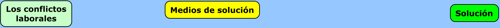
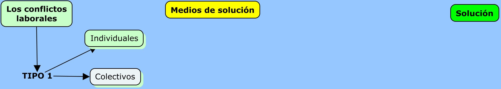
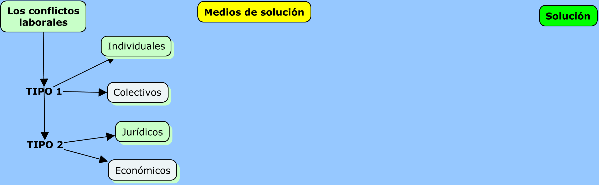
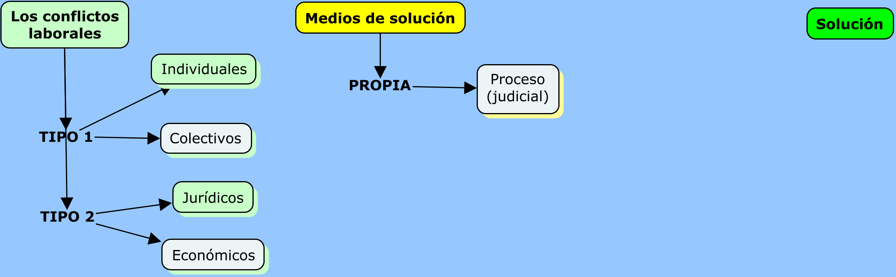
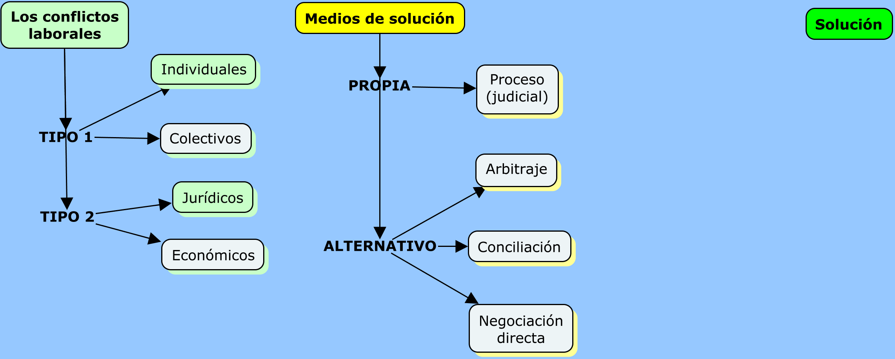
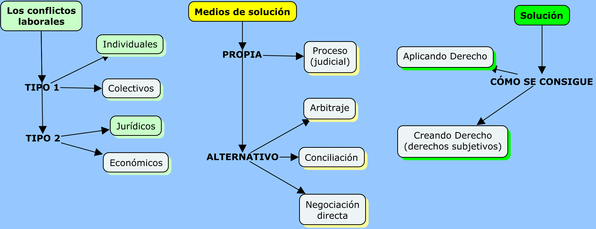
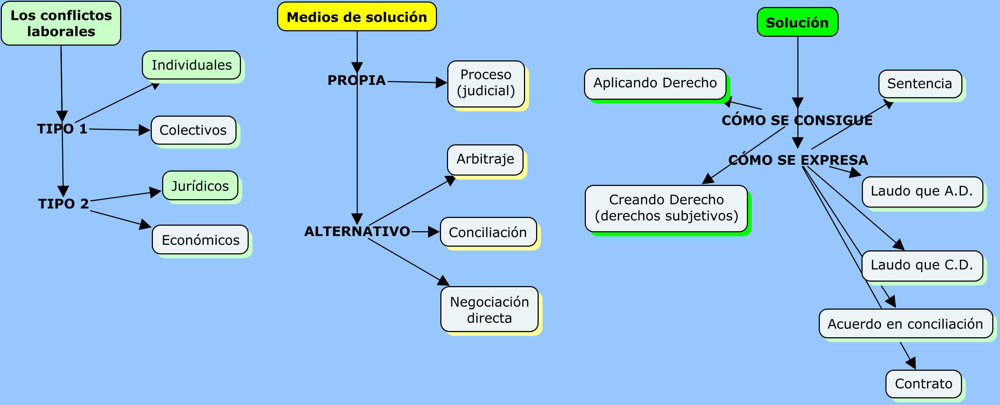

```{r setup, include=FALSE}
options(htmltools.dir.version = FALSE)
knitr::opts_chunk$set(warning = FALSE, message = FALSE, 
                      fig.retina = 3, fig.align = "center")
```

```{r xaringanExtra, echo=FALSE}
xaringanExtra::use_xaringan_extra(c("tile_view"))
xaringanExtra::use_share_again()
```

```{r, echo=FALSE}
xaringanExtra::use_webcam()
```


class: center middle main-title section-title-4

# Conciliación, arbitraje y proceso laboral

.class-info[

.medium[**Paul Paredes**]

Maestría en Derecho Procesal

.light.small[UNMSM<br>
8 de julio de 2022]

]

---

name: outline
class: title title-4

# Plan de la clase

--

.box-4.small[Presentación]

--

.box-4.small[Los mecanismos alternativos de resolución de conflictos]

--

.box-4.small[Conflictos, medios y solución]

--

.box-4.small[MARCs y proceso laboral]

---

layout: false
name: marc
class: center middle section-title section-title-4 animated fadeIn

# Los mecanismos alternativos de resolución de conflictos

---

layout: true
class: title title-4

---

# Caso 1

.box-inv-4.small[Un trabajador después de 35 años de servicios es despedido imputándosele la comisión de una falta grave. Esta consiste en el incumplimiento de sus obligaciones de trabajo que supone el quebrantamiento de la buena fe laboral. El trabajador entra en contacto con su exempleador y luego de varias reuniones han llegado al siguiente acuerdo:]

.box-inv-4.small[1.El trabajador (extrabajador) se compromete a no interponer ninguna demanda y, en caso que la hubiese interpuesto, se compromete a desistirse de la pretensión. Declara que no tiene nada que reclamar a su empleador.]

.box-inv-4.small[2.A cambio, el empleador se compromete --y cumple-- a contratar al hijo menor de su extrabajador.]

---

# Caso 2

.box-inv-4.small[Un trabajador después de más de 10 años de servicios reclama el pago de sus beneficios sociales a su empleador. Nunca le entregó recibo, ni boletas, pero cada fin de mes le pagaba el monto acordado: S/750.00. El extrabajador solicita el pago de las gratificaciones legales, asignación familiar, CTS y, en general, los beneficios que por ley corresponden a los trabajadores sujetos a la actividad privada. El exempleador tiene la voluntad de llegar a un acuerdo. Uno de los puntos de discusión es la fecha de inicio, pues desde esa fecha empezaría el reconocimiento de los derechos. Luego de varias conversaciones las partes llegan al siguiente acuerdo:]

.box-inv-4.small[1.Considerar como fecha de ingreso el 1 de julio de 2015. 2. Calcular los beneficios de ley considerando la suma de S/750.00. 3. Pagar la suma que arroje dicho cálculo en el plazo de 3 días hábiles.]

???

# Caso 3

.box-inv-4.small[Juan tiene en su contrato de trabajo una cláusula en la cual se indica que el empleador se compromete a brindar todas las facilidades que resulten necesarias para la adecuada prestación del servicio, incluyendo facilidades para el traslado a su centro de trabajo. Juan se acaba de comprar un automóvil último modelo. Juan piensa que su empleador debe darle un espacio para estacionar su moderno vehículo o, en todo caso, pagarle la cochera. Su empleador le acaba de responder que "ni hablar, de ninguna manera".]

.box-inv-4.small[Juan ha interpuesto una demanda requiriendo a su empleador 1. la asignación de una plaza en la playa de estacionamiento de la empresa o, alternativamente, asuma el costo del estacionamiento en una playa comercial cercana al lugar de trabajo. Asimismo, ha demandado el monto pagado por estacionamiento desde la fecha del reclamo a su empleador.]


# Caso 4

.box-inv-4.normal[Lo mismo que el caso 3 pero la cláusula no está contenida en el contrato de trabajo sino en el convenio colectivo del año 1998.]

???

Caso 5

.box-inv-4.small[[Asuma que el caso se da antes de la Ley 31047] Andrés está sujeto al régimen laboral del trabajo doméstico. Su remuneración mensual es de S/200.00. Andrés cree que debe ganar S/930.00 pero le siguen pagando S/200.00. ¿Andrés debería reclamar? ¿Qué le aconsejaría usted?]


Caso 6

.box-inv-4[En la sección de "Acabados" trabajan 27 operarios en un espacio de poco más de 50 m<sup>2</sup>. Hace mucho calor, incluso en invierno. Los trabajadores han solicitado que la empresa coloque aire acondicionado pero les han contestado que no están obligados a ello. El sindicato piensa incluir dicho punto en el próximo pliego de reclamos. ¿Qué les diría usted?]


---

# Conflictos, medios y solución

&nbsp;



---

# Los conflictos laborales



---

# Los conflictos laborales



---

# Medios de solución



---

# Medios de solución



---

# Solución



---

# Solución



---

# MARCs: conciliación y arbitraje

.box-4[Conciliación]

.box-inv-4.small[Es un mecanismo para resolver un conflicto de intereses]

--

.box-4.sp-after.small[
¿De qué manera se resuelve un conflicto en conciliación?
]

.box-inv-4.sp-after.small[
+ Mediante el acuerdo:: llegando a un acuerdo
]

.box-4.small[Es el acuerdo lo que pone fin al conflicto] 

.box-4.small[Es el acuerdo el modo de resolver el conflicto]


---

# Conciliación

.box-4[¿Ese acuerdo tiene algún parámetro de validez?]

.box-inv-4[**Tesis 1 - A**]

.box-4.small[A. El derecho :: derechos disponibles de las partes]

.small[
> (D. Leg. 1070) Artículo 7.- Materias conciliables

> Son materia de conciliación las pretensiones determinadas o determinables que versen sobre derechos disponibles de las partes.
]

.box-inv-4.smaller[Entonces, solo los derechos laborales disponibles serían susceptibles de conciliar]

---

# Conciliación

.box-4[¿Ese acuerdo tiene algún parámetro de validez?]

.box-inv-4[**Tesis 1 - B**]

.box-4.small[B. Los hechos :: la verdad como correspondencia]

---

# Criterios de verdad

.box-4.small[Los hechos :: la verdad como correspondencia]

.box-inv-4.sp-after.smaller[

+ Verdad como correspondencia con la realidad: `"La afirmación 'La Tierra es plana' es V/F porque hay suficientes elementos de corroboración de lo afirmado".`
]

.box-inv-4.sp-after.smaller[

+ Verdad como consenso: acuerdo: `"Todos (la mayoría, algunos, alguien) acordamos que 'La Tierra es plana'."` 

+ Los motivos del acuerdo pueden ser las creencias, la conveniencia, la utilidad, etc.
]

.box-inv-4.smaller[

+ Verdad como persuasión: victoria en el ánimo, en la conciencia del decisor: `"Tengo la convicción, la certeza, de que 'la Tierra es plana'."`
]

---

# Conciliación

.box-4[¿Ese acuerdo tiene algún parámetro de validez?]

.box-inv-4[**Tesis 2**]

.box-4[El principio dispositivo]

.center.float-left[.box-inv-4[Iniciativa de parte] .box-inv-4[Según lo alegado y probado]]

.center[

> *Yo soy dueño de mis conflictos*

> *Yo los propongo, yo los concluyo*
]
---

# La NLPT y la conciliación

.box-4.medium[Características del acuerdo en conciliación:]

.box-inv-4.medium[Libre]

.box-inv-4.medium[Informado]

.box-inv-4.medium[De buena fe]

---

# El arbitraje jurídico laboral

+ Es un mecanismo para resolver un conflicto de intereses.

+ ¿De qué manera se resuelve un conflicto jurídico en arbitraje?

+ Aplicando derecho

---

# El arbitraje jurídico

.box-inv-4.small[+ Parámetros de validez del acuerdo de someter el conflicto a arbitraje jurídico

El derecho :: derechos disponibles de las partes y aquellas que la ley autorice
]

.small[
 > (D. Leg. 1071) Artículo 2.- Materias susceptibles de arbitraje.

 > 1. Pueden someterse a arbitraje las controversias sobre materias de libre disposición conforme a derecho, así como aquellas que la ley o los tratados o acuerdos internacionales autoricen.
]

.box-inv-4.small[Entonces, solo los derechos laborales disponibles serían susceptibles de llevar a arbitraje. + Pero también podría sostenerse que `lo laboral` es una materia autorizada por ley.]

---

# El arbitraje jurídico

+ Parámetros de validez del acuerdo de someter el conflicto a arbitraje jurídico

 > (NLPT. Disp. Complem.) SEXTA.- Las controversias jurídicas en materia laboral pueden ser sometidas a arbitraje, siempre y cuando el convenio arbitral se inserte a la conclusión de la relación laboral y, adicionalmente, la remuneración mensual percibida sea, o haya sido, superior a las setenta (70) Unidades de Referencia Procesal (URP).


---

# El arbitraje jurídico

.box-4[Debe cumplir 2 condiciones:]

.box-inv-4[1.El convenio arbitral solo puede pactarse a la conclusión de la relación laboral]

.box-inv-4[2.La remuneración mensual percibida debe haber sido mayor a 70 URP (en 2022 > S/32,200)]

---

# La NLPT y el arbitraje jurídico

.box-4.medium[Características del acuerdo que somete el conflicto a arbitraje jurídico:]

.box-inv-4.medium[Libre]

.box-inv-4.medium[Con garantía de solvencia]

.box-inv-4.medium[De buena fe]


---

# ¿Cuál es la función del proceso?

.box-inv-4.sp-after.smaller[

+ El proceso como mero mecanismo de resolución de controversias antes que como medio de `actuación del derecho :: decir derecho :: aplicar derecho`.
]

.box-inv-4.sp-after.smaller[
+ El proceso como instancia de `construcción de una realidad para persuadir al juzgador`.
]

.box-4.small[
+ El proceso como un `mecanismo de solución de conflictos donde se aplica el derecho vigente en un país sobre los hechos sucedidos` antes que como mera instancia de resolución de controversias.
]

---

# Comparación (1)

<style type="text/css">
.tg  {border-collapse:collapse;border-spacing:0;}
.tg td{border-color:black;border-style:solid;border-width:1px;font-family:Arial, sans-serif;font-size:14px;
  overflow:hidden;padding:10px 5px;word-break:normal;}
.tg th{border-color:black;border-style:solid;border-width:1px;font-family:Arial, sans-serif;font-size:14px;
  font-weight:normal;overflow:hidden;padding:10px 5px;word-break:normal;}
.tg .tg-umkb{background-color:#67fd9a;border-color:#000000;font-family:Georgia, serif !important;;font-size:16px;text-align:left;
  vertical-align:top}
.tg .tg-10x8{background-color:#c0c0c0;border-color:#000000;font-family:Georgia, serif !important;;font-size:16px;font-weight:bold;
  text-align:left;vertical-align:top}
.tg .tg-bhpe{background-color:#67fd9a;border-color:#000000;font-family:Georgia, serif !important;;font-size:16px;font-weight:bold;
  text-align:center;vertical-align:top}
.tg .tg-3245{border-color:#000000;font-family:Georgia, serif !important;;font-size:16px;text-align:left;vertical-align:top}
.tg .tg-k6mb{border-color:#000000;font-family:Georgia, serif !important;;font-size:16px;text-align:center;vertical-align:top}
</style>
<table class="tg">
<thead>
  <tr>
    <th class="tg-umkb"></th>
    <th class="tg-bhpe">Conflicto jurídico</th>
    <th class="tg-bhpe">Conflicto económico</th>
  </tr>
</thead>
<tbody>
  <tr>
    <td class="tg-10x8">Origen</td>
    <td class="tg-3245">Un conflicto, una insatisfacción</td>
    <td class="tg-3245">Un conflicto, una insatisfacción</td>
  </tr>
  <tr>
    <td class="tg-10x8">¿Cómo resolverlo?</td>
    <td class="tg-3245">Aplicando derecho:<br>ello supone que existe una norma que contiene la solución,<br>entonces, lo que se pide es aplicar la norma, o,<br>interpretarla del modo como se pretende</td>
    <td class="tg-3245">Creando derecho:<br>ello supone que no existe la norma que contiene la solución,<br>o que la que existe es insuficiente (vaga, ambigua),<br>o para garantizar mejor un derecho</td>
  </tr>
  <tr>
    <td class="tg-10x8">Medio típico de aplicación de derecho</td>
    <td class="tg-3245">La sentencia</td>
    <td class="tg-k6mb">---</td>
  </tr>
  <tr>
    <td class="tg-10x8">Medio típico de creación de derecho</td>
    <td class="tg-k6mb">---</td>
    <td class="tg-3245">El acuerdo contractual,<br>El consenso legislativo,<br>El convenio colectivo</td>
  </tr>
  <tr>
    <td class="tg-10x8">Vía típica de canalización</td>
    <td class="tg-3245">El proceso (judicial)</td>
    <td class="tg-3245">El procedimiento legislativo<br>La negociación<br>La conciliación<br>La negociación colectiva</td>
  </tr>
</tbody>
</table>

---

# Comparación (2)

<style type="text/css">
.tg  {border-collapse:collapse;border-spacing:0;}
.tg td{border-color:black;border-style:solid;border-width:1px;font-family:Arial, sans-serif;font-size:14px;
  overflow:hidden;padding:10px 5px;word-break:normal;}
.tg th{border-color:black;border-style:solid;border-width:1px;font-family:Arial, sans-serif;font-size:14px;
  font-weight:normal;overflow:hidden;padding:10px 5px;word-break:normal;}
.tg .tg-umkb{background-color:#EA7177;border-color:#000000;font-family:Georgia, serif !important;;font-size:16px;text-align:left;
  vertical-align:top}
.tg .tg-10x8{background-color:#c0c0c0;border-color:#000000;font-family:Georgia, serif !important;;font-size:16px;font-weight:bold;
  text-align:left;vertical-align:top}
.tg .tg-bhpe{background-color:#EA7177;border-color:#000000;font-family:Georgia, serif !important;;font-size:16px;font-weight:bold;
  text-align:center;vertical-align:top}
.tg .tg-3245{border-color:#000000;font-family:Georgia, serif !important;;font-size:16px;text-align:left;vertical-align:top}
</style>
<table class="tg">
<thead>
  <tr>
    <th class="tg-umkb"></th>
    <th class="tg-bhpe">Conflicto jurídico</th>
    <th class="tg-bhpe">Conflicto económico</th>
  </tr>
</thead>
<tbody>
  <tr>
    <td class="tg-10x8">Vías alternativas</td>
    <td class="tg-3245">La conciliación<br>La mediación<br>El arbitraje</td>
    <td class="tg-3245">La conciliación<br>La mediación<br>El arbitraje<br>La huelga</td>
  </tr>
  <tr>
    <td class="tg-10x8">Acto de presentación (postulación)</td>
    <td class="tg-3245">La demanda</td>
    <td class="tg-3245">La propuesta legislativa<br>La propuesta contractual<br>El pliego de reclamos</td>
  </tr>
  <tr>
    <td class="tg-10x8">Resultado o producto</td>
    <td class="tg-3245">La sentencia<br>El acuerdo en conciliación*<br>La transacción*<br>El laudo arbitral jurídico</td>
    <td class="tg-3245">La ley<br>El contrato<br>El acuerdo en conciliación<br>El laudo arbitral económico</td>
  </tr>
  <tr>
    <td class="tg-10x8">Consecuencia respecto del resultado</td>
    <td class="tg-3245">Se cumple.<br>Si no: proceso de ejecución</td>
    <td class="tg-3245">Se cumple.<br>Si no: proceso de conocimiento</td>
  </tr>
</tbody>
</table>

---

layout: false
name: gracias
class: center middle section-title section-title-4 animated fadeIn

# ¡Muchas gracias!


.box-4.medium[pgparede@pucp.pe]

