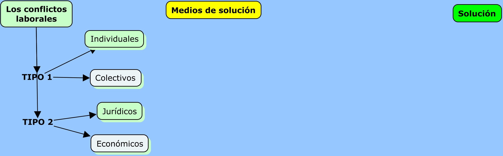
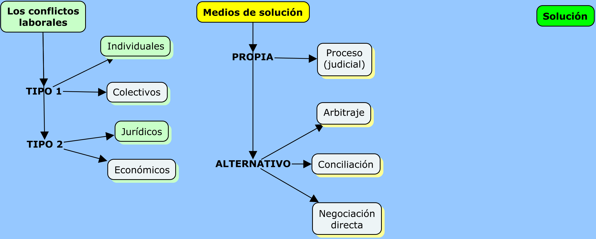

```{r setup, include=FALSE}
options(htmltools.dir.version = FALSE)
knitr::opts_chunk$set(warning = FALSE, message = FALSE, 
                      fig.retina = 3, fig.align = "center")
```

```{r xaringanExtra, echo=FALSE}
xaringanExtra::use_xaringan_extra(c("tile_view"))
xaringanExtra::use_share_again()
```

```{r, echo=FALSE}
xaringanExtra::use_webcam()
```


class: center middle main-title section-title-4

# Conciliación laboral y entidades del Estado

.class-info[

.medium[**Paul Paredes**]

**Programa Presupuestal 0099**

.light.small[Poder Judicial<br>
18 de agosto, 2022]

]

---

name: outline
class: title title-4

# Plan de la ponencia

--

.box-4.small[Planteamiento del problema]

.box-4.small[La conciliación como MARC]

.box-4.small[Dos tesis sobre la conciliación en los procesos laborales]

.box-4.small[La conciliación en la NLPT]

.box-4.small[El juzgamiento anticipado y la rebeldía]

.box-4.small[La conciliación y las entidades del Estado]

.box-4.small[Conclusiones]


---

layout: false
name: planteamiento
class: center middle section-title section-title-4 animated fadeIn

# Planteamiento del problema

---

layout: true
class: title title-4

---
# Planteamiento del problema

--

.box-4.large[¿Qué particularidades trae la conciliación en un proceso laboral cuando una de las partes es una entidad del Estado?]

---
layout: false

<div style='position: relative; padding-bottom: 56.25%; padding-top: 35px; height: 0; overflow: hidden;'><iframe sandbox='allow-scripts allow-same-origin allow-presentation' allowfullscreen='true' allowtransparency='true' frameborder='0' height='315' src='https://www.mentimeter.com/app/presentation/39f1c5f8a0f764d9b1dd00dc924eac55/b62a15196ad3/embed' style='position: absolute; top: 0; left: 0; width: 100%; height: 100%;' width='420'></iframe></div>

---

<div style='position: relative; padding-bottom: 56.25%; padding-top: 35px; height: 0; overflow: hidden;'><iframe sandbox='allow-scripts allow-same-origin allow-presentation' allowfullscreen='true' allowtransparency='true' frameborder='0' height='315' src='https://www.mentimeter.com/app/presentation/39f1c5f8a0f764d9b1dd00dc924eac55/b62a15196ad3/embed' style='position: absolute; top: 0; left: 0; width: 100%; height: 100%;' width='420'></iframe></div>


---
layout: true
class: title title-4

---

# Caso 1

.box-inv-4.small[Un trabajador después de 35 años de servicios es despedido imputándosele la comisión de una falta grave. Esta consiste en el incumplimiento de sus obligaciones de trabajo que supone el quebrantamiento de la buena fe laboral. En la audiencia de conciliación han llegado al siguiente acuerdo:]

.box-inv-4.small[1.El extrabajador se compromete a desistirse de la pretensión y declarar que no tiene nada que reclamar a su exempleador.]

.box-inv-4.small[2.A cambio, el exempleador se compromete a contratar en ese mismo momento al hijo menor del demandante (su extrabajador).]

???

.box-inv-4.small[Un trabajador después de 35 años de servicios es despedido imputándosele la comisión de una falta grave. Esta consiste en el incumplimiento de sus obligaciones de trabajo que supone el quebrantamiento de la buena fe laboral. El trabajador entra en contacto con su exempleador y luego de varias reuniones han llegado al siguiente acuerdo:]

.box-inv-4.small[1.El trabajador (extrabajador) se compromete a no interponer ninguna demanda y, en caso que la hubiese interpuesto, se compromete a desistirse de la pretensión. Declara que no tiene nada que reclamar a su empleador.]

.box-inv-4.small[2.A cambio, el empleador se compromete --y cumple-- a contratar al hijo menor de su extrabajador.]

---
layout: false

<div style='position: relative; padding-bottom: 56.25%; padding-top: 35px; height: 0; overflow: hidden;'><iframe sandbox='allow-scripts allow-same-origin allow-presentation' allowfullscreen='true' allowtransparency='true' frameborder='0' height='315' src='https://www.mentimeter.com/app/presentation/a6203063971e2444e58afad01b0594df/d579f5abc3cb/embed' style='position: absolute; top: 0; left: 0; width: 100%; height: 100%;' width='420'></iframe></div>

---

layout: true
class: title title-4

---

# Caso 2

.box-inv-4.small[Un trabajador después de más de 10 años de servicios reclama el pago de sus beneficios sociales a su empleador. Nunca le entregó recibo, ni boletas, pero cada fin de mes le pagaba el monto acordado: S/1,000.00. El extrabajador solicita el pago de las gratificaciones legales, asignación familiar, CTS y, en general, los beneficios que por ley corresponden a los trabajadores sujetos a la actividad privada. El exempleador tiene la voluntad de llegar a un acuerdo. Uno de los puntos de discusión es la fecha de inicio, pues desde esa fecha empezaría el reconocimiento de los derechos. Luego del intercambio de pareceres las partes llegan al siguiente acuerdo:]

.box-inv-4.small[1.Considerar como fecha de ingreso el 1 de julio de 2015. 2. Calcular los beneficios de ley considerando la suma de S/1,000.00. 3. Pagar la suma que arroje dicho cálculo en el plazo de 3 días hábiles.]

---
layout: false

<div style='position: relative; padding-bottom: 56.25%; padding-top: 35px; height: 0; overflow: hidden;'><iframe sandbox='allow-scripts allow-same-origin allow-presentation' allowfullscreen='true' allowtransparency='true' frameborder='0' height='315' src='https://www.mentimeter.com/app/presentation/a6203063971e2444e58afad01b0594df/d579f5abc3cb/embed' style='position: absolute; top: 0; left: 0; width: 100%; height: 100%;' width='420'></iframe></div>


---

layout: true
class: title title-4

---

# Caso 3

.box-inv-4.small[Francisco es contratado por una municipalidad para prestar el servicio de seguridad interna. La municipalidad le paga la suma de S/1,500.00 y él, a cambio, debe entregarle un recibo por honorarios. La municipalidad le provee de uniforme. La municipalidad, después de 4 años, ha decidido no renovarle el contrato. Francisco ha demandado la reposición como trabajador obrero de la municipalidad. Luego del intercambio de pareceres las partes han llegado al siguiente acuerdo:]

.box-inv-4.small[1.Reponer al demandante en el puesto de jardinero bajo contrato CAS con un plazo de vigencia de un año contado desde la fecha del acuerdo.]


???


Caso 3

.box-inv-4.small[Juan tiene en su contrato de trabajo una cláusula en la cual se indica que el empleador se compromete a brindar todas las facilidades que resulten necesarias para la adecuada prestación del servicio, incluyendo facilidades para el traslado a su centro de trabajo. Juan se acaba de comprar un automóvil último modelo. Juan piensa que su empleador debe darle un espacio para estacionar su moderno vehículo o, en todo caso, pagarle la cochera. Su empleador le acaba de responder que "ni hablar, de ninguna manera".]

.box-inv-4.small[Juan ha interpuesto una demanda requiriendo a su empleador 1. la asignación de una plaza en la playa de estacionamiento de la empresa o, alternativamente, asuma el costo del estacionamiento en una playa comercial cercana al lugar de trabajo. Asimismo, ha demandado el monto pagado por estacionamiento desde la fecha del reclamo a su empleador.]

Caso 4

.box-inv-4.normal[Lo mismo que el caso 3 pero la cláusula no está contenida en el contrato de trabajo sino en el convenio colectivo del año 1998.]


Caso 5

.box-inv-4.small[[Asuma que el caso se da antes de la Ley 31047] Andrés está sujeto al régimen laboral del trabajo doméstico. Su remuneración mensual es de S/200.00. Andrés cree que debe ganar S/930.00 pero le siguen pagando S/200.00. ¿Andrés debería reclamar? ¿Qué le aconsejaría usted?]


Caso 6

.box-inv-4[En la sección de "Acabados" trabajan 27 operarios en un espacio de poco más de 50 m<sup>2</sup>. Hace mucho calor, incluso en invierno. Los trabajadores han solicitado que la empresa coloque aire acondicionado pero les han contestado que no están obligados a ello. El sindicato piensa incluir dicho punto en el próximo pliego de reclamos. ¿Qué les diría usted?]

---
layout: false

<div style='position: relative; padding-bottom: 56.25%; padding-top: 35px; height: 0; overflow: hidden;'><iframe sandbox='allow-scripts allow-same-origin allow-presentation' allowfullscreen='true' allowtransparency='true' frameborder='0' height='315' src='https://www.mentimeter.com/app/presentation/28666d814cd0767f0d8f4377ef51a250/e3c76aa915f4/embed' style='position: absolute; top: 0; left: 0; width: 100%; height: 100%;' width='420'></iframe></div>

---

layout: false
name: conciliacion
class: center middle section-title section-title-4 animated fadeIn

# La conciliación como MARC

---

layout: true
class: title title-4

---

# Conflictos, medios y solución

&nbsp;


---

# Los conflictos laborales


---

# Los conflictos laborales



---

# Medios de solución


---

# Medios de solución



---

# Solución


---

# Solución


---

layout: false
name: dostesis
class: center middle section-title section-title-4 animated fadeIn

# Dos tesis sobre la conciliación en los procesos laborales

---

layout: true
class: title title-4

---

# La conciliación

.box-4[Conciliación]

.box-inv-4.small[Es un mecanismo para resolver un conflicto de intereses]

--

.box-4.sp-after.small[
¿De qué manera se resuelve un conflicto en conciliación?
]

--

.box-inv-4.sp-after.small[
+ Mediante el acuerdo:: llegando a un acuerdo
]

.box-4.small[Es el acuerdo lo que pone fin al conflicto] 

.box-4.small[Es el acuerdo el modo de resolver el conflicto]


---

# Conciliación

.box-4[¿Ese acuerdo tiene algún parámetro de validez?]

.box-inv-4[**Tesis 1 - A**]

.box-4.small[A. El derecho :: derechos disponibles de las partes]

.center.float-left[.box-inv-4.small[NLPT] .box-inv-4.small[30 a)] .box-inv-4.small[Derechos disponibles]]

.center.float-left[.box-inv-4.small[TUO LRPCA] .box-inv-4.small[42] .box-inv-4.small[Derechos disponibles]]

.center.float-left[.box-inv-4.small[D.Leg.1070] .box-inv-4.small[7] .box-inv-4.small[Derechos disponibles]]

.box-4.smaller[Entonces, solo los derechos laborales disponibles serían susceptibles de conciliar]


???

.box-inv-4.smaller[(D. Leg. 1070) Artículo 7.- Materias conciliables]

.box-inv-4.smaller[Son materia de conciliación las pretensiones determinadas o determinables que versen sobre derechos disponibles de las partes.]


---

# Conciliación

.box-4[¿Ese acuerdo tiene algún parámetro de validez?]

.box-inv-4[**Tesis 1 - B**]

.box-4.small[B. Los hechos :: la verdad como correspondencia]


???

Criterios de verdad

.box-4.small[Los hechos :: la verdad como correspondencia]

.box-inv-4.sp-after.smaller[

+ Verdad como correspondencia con la realidad: `"La afirmación 'La Tierra es plana' es V/F porque hay suficientes elementos de corroboración de lo afirmado".`
]

.box-inv-4.sp-after.smaller[

+ Verdad como consenso: acuerdo: `"Todos (la mayoría, algunos, alguien) acordamos que 'La Tierra es plana'."` 

+ Los motivos del acuerdo pueden ser las creencias, la conveniencia, la utilidad, etc.
]

.box-inv-4.smaller[

+ Verdad como persuasión: victoria en el ánimo, en la conciencia del decisor: `"Tengo la convicción, la certeza, de que 'la Tierra es plana'."`
]

---

# Conciliación

.box-4[¿Ese acuerdo tiene algún parámetro de validez?]

.box-inv-4[**Tesis 2**]

.box-4[El principio dispositivo]

.center.float-left[.box-inv-4[Iniciativa de parte] .box-inv-4[Según lo alegado y probado]]

.center[

> *Yo soy dueño de mis conflictos*

> *Yo los propongo, yo los concluyo*
]
---

layout: false
name: nlptyconciliacion
class: center middle section-title section-title-4 animated fadeIn

# La conciliación en la NLPT

---

layout: true
class: title title-4

---

# La NLPT y la conciliación

.box-4.medium[Características del acuerdo en conciliación:]

.box-inv-4.less-medium[Libre - Adoptado por el titular del derecho]

.box-inv-4.less-medium[Informado - Con participación del abogado del prestador de servicios demandante]

.box-inv-4.less-medium[De buena fe - Fundamento del proceso laboral]

???

El arbitraje jurídico laboral

+ Es un mecanismo para resolver un conflicto de intereses.

+ ¿De qué manera se resuelve un conflicto jurídico en arbitraje?

+ Aplicando derecho


El arbitraje jurídico

.box-inv-4.small[+ Parámetros de validez del acuerdo de someter el conflicto a arbitraje jurídico

El derecho :: derechos disponibles de las partes y aquellas que la ley autorice
]

.small[
 > (D. Leg. 1071) Artículo 2.- Materias susceptibles de arbitraje.

 > 1. Pueden someterse a arbitraje las controversias sobre materias de libre disposición conforme a derecho, así como aquellas que la ley o los tratados o acuerdos internacionales autoricen.
]

.box-inv-4.small[Entonces, solo los derechos laborales disponibles serían susceptibles de llevar a arbitraje. + Pero también podría sostenerse que `lo laboral` es una materia autorizada por ley.]


El arbitraje jurídico

+ Parámetros de validez del acuerdo de someter el conflicto a arbitraje jurídico

 > (NLPT. Disp. Complem.) SEXTA.- Las controversias jurídicas en materia laboral pueden ser sometidas a arbitraje, siempre y cuando el convenio arbitral se inserte a la conclusión de la relación laboral y, adicionalmente, la remuneración mensual percibida sea, o haya sido, superior a las setenta (70) Unidades de Referencia Procesal (URP).


El arbitraje jurídico

.box-4[Debe cumplir 2 condiciones:]

.box-inv-4[1.El convenio arbitral solo puede pactarse a la conclusión de la relación laboral]

.box-inv-4[2.La remuneración mensual percibida debe haber sido mayor a 70 URP (en 2021 > S/30,800)]


La NLPT y el arbitraje jurídico

.box-4.medium[Características del acuerdo que somete el conflicto a arbitraje jurídico:]

.box-inv-4.medium[Libre]

.box-inv-4.medium[Con garantía de solvencia]

.box-inv-4.medium[De buena fe]


---

# ¿Cuál es la función del proceso?

.box-inv-4.sp-after.smaller[

+ El proceso como instancia de .white[construcción de una realidad para persuadir al juzgador.]
]

.box-inv-4.sp-after.smaller[

+ El proceso como mero mecanismo de resolución de controversias antes que como medio de .white[actuación del derecho.]
]

.box-4.small[
+ El proceso como un .naranja[mecanismo de solución de conflictos donde se aplica el derecho vigente en un país sobre los hechos sucedidos] (decir derecho,aplicar derecho) antes que como mera instancia de resolución de controversias.
]

???

Comparación (1)

<style type="text/css">
.tg  {border-collapse:collapse;border-spacing:0;}
.tg td{border-color:black;border-style:solid;border-width:1px;font-family:Arial, sans-serif;font-size:14px;
  overflow:hidden;padding:10px 5px;word-break:normal;}
.tg th{border-color:black;border-style:solid;border-width:1px;font-family:Arial, sans-serif;font-size:14px;
  font-weight:normal;overflow:hidden;padding:10px 5px;word-break:normal;}
.tg .tg-umkb{background-color:#67fd9a;border-color:#000000;font-family:Georgia, serif !important;;font-size:16px;text-align:left;
  vertical-align:top}
.tg .tg-10x8{background-color:#c0c0c0;border-color:#000000;font-family:Georgia, serif !important;;font-size:16px;font-weight:bold;
  text-align:left;vertical-align:top}
.tg .tg-bhpe{background-color:#67fd9a;border-color:#000000;font-family:Georgia, serif !important;;font-size:16px;font-weight:bold;
  text-align:center;vertical-align:top}
.tg .tg-3245{border-color:#000000;font-family:Georgia, serif !important;;font-size:16px;text-align:left;vertical-align:top}
.tg .tg-k6mb{border-color:#000000;font-family:Georgia, serif !important;;font-size:16px;text-align:center;vertical-align:top}
</style>
<table class="tg">
<thead>
  <tr>
    <th class="tg-umkb"></th>
    <th class="tg-bhpe">Conflicto jurídico</th>
    <th class="tg-bhpe">Conflicto económico</th>
  </tr>
</thead>
<tbody>
  <tr>
    <td class="tg-10x8">Origen</td>
    <td class="tg-3245">Un conflicto, una insatisfacción</td>
    <td class="tg-3245">Un conflicto, una insatisfacción</td>
  </tr>
  <tr>
    <td class="tg-10x8">¿Cómo resolverlo?</td>
    <td class="tg-3245">Aplicando derecho:<br>ello supone que existe una norma que contiene la solución,<br>entonces, lo que se pide es aplicar la norma, o,<br>interpretarla del modo como se pretende</td>
    <td class="tg-3245">Creando derecho:<br>ello supone que no existe la norma que contiene la solución,<br>o que la que existe es insuficiente (vaga, ambigua),<br>o para garantizar mejor un derecho</td>
  </tr>
  <tr>
    <td class="tg-10x8">Medio típico de aplicación de derecho</td>
    <td class="tg-3245">La sentencia</td>
    <td class="tg-k6mb">---</td>
  </tr>
  <tr>
    <td class="tg-10x8">Medio típico de creación de derecho</td>
    <td class="tg-k6mb">---</td>
    <td class="tg-3245">El acuerdo contractual,<br>El consenso legislativo,<br>El convenio colectivo</td>
  </tr>
  <tr>
    <td class="tg-10x8">Vía típica de canalización</td>
    <td class="tg-3245">El proceso (judicial)</td>
    <td class="tg-3245">El procedimiento legislativo<br>La negociación<br>La conciliación<br>La negociación colectiva</td>
  </tr>
</tbody>
</table>


Comparación (2)

<style type="text/css">
.tg  {border-collapse:collapse;border-spacing:0;}
.tg td{border-color:black;border-style:solid;border-width:1px;font-family:Arial, sans-serif;font-size:14px;
  overflow:hidden;padding:10px 5px;word-break:normal;}
.tg th{border-color:black;border-style:solid;border-width:1px;font-family:Arial, sans-serif;font-size:14px;
  font-weight:normal;overflow:hidden;padding:10px 5px;word-break:normal;}
.tg .tg-umkb{background-color:#EA7177;border-color:#000000;font-family:Georgia, serif !important;;font-size:16px;text-align:left;
  vertical-align:top}
.tg .tg-10x8{background-color:#c0c0c0;border-color:#000000;font-family:Georgia, serif !important;;font-size:16px;font-weight:bold;
  text-align:left;vertical-align:top}
.tg .tg-bhpe{background-color:#EA7177;border-color:#000000;font-family:Georgia, serif !important;;font-size:16px;font-weight:bold;
  text-align:center;vertical-align:top}
.tg .tg-3245{border-color:#000000;font-family:Georgia, serif !important;;font-size:16px;text-align:left;vertical-align:top}
</style>
<table class="tg">
<thead>
  <tr>
    <th class="tg-umkb"></th>
    <th class="tg-bhpe">Conflicto jurídico</th>
    <th class="tg-bhpe">Conflicto económico</th>
  </tr>
</thead>
<tbody>
  <tr>
    <td class="tg-10x8">Vías alternativas</td>
    <td class="tg-3245">La conciliación<br>La mediación<br>El arbitraje</td>
    <td class="tg-3245">La conciliación<br>La mediación<br>El arbitraje<br>La huelga</td>
  </tr>
  <tr>
    <td class="tg-10x8">Acto de presentación (postulación)</td>
    <td class="tg-3245">La demanda</td>
    <td class="tg-3245">La propuesta legislativa<br>La propuesta contractual<br>El pliego de reclamos</td>
  </tr>
  <tr>
    <td class="tg-10x8">Resultado o producto</td>
    <td class="tg-3245">La sentencia<br>El acuerdo en conciliación*<br>La transacción*<br>El laudo arbitral jurídico</td>
    <td class="tg-3245">La ley<br>El contrato<br>El acuerdo en conciliación<br>El laudo arbitral económico</td>
  </tr>
  <tr>
    <td class="tg-10x8">Consecuencia respecto del resultado</td>
    <td class="tg-3245">Se cumple.<br>Si no: proceso de ejecución</td>
    <td class="tg-3245">Se cumple.<br>Si no: proceso de conocimiento</td>
  </tr>
</tbody>
</table>

---

layout: false
class: center middle section-title section-title-4 animated fadeIn

# El juzgamiento anticipado y la rebeldía

---

layout: true
class: title title-4

---
# Razones subyacentes

.box-inv-4.sp-after.small[
Importancia de la conciliación en el modelo de la NLPT
]

.box-inv-4.sp-after.small[
No son dos audiencias *obligatorias*
]

.box-inv-4.sp-after.small[
Incentivos que modulan la conducta hacia el acuerdo
]

.center.float-left[
.box-4[Juzgamiento anticipado]
.box-4[Rebeldía]
.box-4[-->]
.box-4[Aud. conciliación]
]

.box-4[La aud. conciliación como única audiencia]

.center.float-left[
.box-inv-4.small[Única porque hubo acuerdo]
.box-inv-4.small[Única porque hubo juzgamiento anticipado]
]

---

# Razones subyacentes

.box-4.small[1.Una justicia oportuna]

.box-4.small[2.Funcionalidad del proceso]

.center.float-left[.box-inv-4[]
.box-inv-4[Hechos admitidos]
.box-inv-4[Hechos necesitados de prueba]
.box-inv-4[Conducta procesal]
.box-inv-4[Presunción relativa de verdad de la demanda]
]

---
# Dos modalidades de juzg. anticipado

.box-4.small[Primera modalidad]

.box-inv-4.smaller[
Segundo párrafo del inciso 2 del artículo 43°:
]

.smaller[
> «Por decisión de las partes la conciliación puede prolongarse lo necesario hasta que se dé por agotada, pudiendo incluso continuar los días hábiles siguientes, cuantas veces sea necesario, en un lapso no mayor de un (1) mes. Si las partes acuerdan la solución parcial o total de su conflicto el juez, en el acto, aprueba lo acordado con efecto de cosa juzgada; asimismo, ordena el cumplimiento de las prestaciones acordadas en el plazo establecido por las partes o, en su defecto, en el plazo de cinco (5) días hábiles siguientes. **Del mismo modo, si algún extremo no es controvertido, el juez emite resolución con calidad de cosa juzgada ordenando su pago en igual plazo.**»
]

---
# Dos modalidades de juzg. anticipado

.box-4.small[Segunda modalidad]

.box-inv-4.smaller[
Segundo párrafo del inciso 3 del artículo 43°:
]

.smaller[
> «Si el juez advierte, haya habido o no contestación, que la cuestión debatida es solo de derecho, o que siendo también de hecho no hay necesidad de actuar medio probatorio alguno, solicita a los abogados presentes exponer sus alegatos, a cuyo término, o en un lapso no mayor de sesenta (60) minutos, dicta el fallo de su sentencia. La notificación de la sentencia se realiza de igual modo a lo regulado para el caso de la sentencia dictada en la audiencia de juzgamiento.»
]

.box-inv-4.small[Esta modalidad no depende de la rebeldía. La rebeldía es solo un subtipo desencadenante del juzgamiento anticipado]

---
# JA: segunda modalidad

.box-4[Supuestos]

.box-inv-4[Cuando la causa es solo de derecho]

.box-inv-4[Cuando siendo de hecho no existe necesidad de actuar medio probatorio alguno. Ver art. 46*.]

.box-inv-5.small[*Hechos admitidos, presumidos por ley, notorios y recogidos en resolución con calidad de cosa juzgada]

.box-inv-5.small[**No es determinante del JA si se contestó o no la demanda]

---
# Rebeldía

.center.float-left[
.box-inv-4[Significado del silencio]
.box-inv-4[Conductas no colaborativas del demandado]
]

.box-4.sp-after[
Segundo párrafo del artículo 19°:
]

.box-4[
«Si el demandado no niega expresamente los hechos expuestos en la demanda, estos son considerados admitidos».
]

---
# Rebeldía

.box-4[Primera idea: ¿sanción?]

.small[
> .box-inv-4[(...), cuando el demandado no contesta o no asiste a la audiencia de conciliación o no cumple con el requisito de acudir con poderes suficientes para conciliar, el sistema asume que expresa su conformidad sobre los hechos de la demanda a fin de precluir con la etapa de la contestación, avanzar a las siguientes y cumplir su finalidad de solución de los conflictos.

P. Paredes. Base doctrinal del juzgamiento anticipado, p. 6.
]]

---
# Rebeldía

.box-4[Segunda idea: conducta voluntaria de la parte]

.box-inv-4[Verificar el emplazamiento al demandado]

.box-4[Tercera idea: en el PAL el JA carece de mayor utilidad práctica, aunque la rebeldía generaría que los hechos se reputen admitidos]

---
# Rebeldía y juzgamiento anticipado

&nbsp;

&nbsp;

.box-4.medium[Tres escenarios:]

---
# Rebeldía y juzgamiento anticipado

.box-4[Uno]

.float-left[
+ .box-4.small[Si demandado no asiste, entonces, no contesta la demanda.]

+ .box-4.small[Si no contesta la demanda, no niega expresamente los hechos de la demanda.]

+ .box-4.small[Entonces, los hechos de la demanda son hechos admitidos y no se requiere la actuación de medios probatorios.]
]

---
# Rebeldía y juzgamiento anticipado

.box-4[Dos]

.float-left[
+ .box-4.small[Si demandado asiste, se apersona, pero no contesta la demanda.]
+ .box-4.small[Si no contesta la demanda, no niega expresamente los hechos de la demanda.]
+ .box-4.small[Entonces, los hechos de la demanda son hechos admitidos y no se requiere la actuación de medios probatorios.]
]

---
# Rebeldía y juzgamiento anticipado

.box-4[Tres]

.float-left[
+ .box-4.small[Si demandado asiste, se apersona, (formalmente) contesta la demanda, pero no tiene poderes suficientes para conciliar.]
+ .box-4.small[Si no tiene poderes suficientes para conciliar se incumple con un requisito de la contestación.]
+ .box-4.small[Si se incumple con un requisito de la contestación, se tiene por no contestada.]
+ .box-4.small[Si no contesta la demanda, no niega expresamente los hechos de la demanda.]
+ .box-4.small[Entonces, los hechos de la demanda son hechos admitidos y no se requiere la actuación de medios probatorios.]
]

???

Rebeldía y dirección del juez

.box-inv-4[
+ Si juez no aplica el JA sería porque ha visto los MP y que considere que 1. contradicen la demanda o 2 no la sustentan.
]

---

layout: false
name: entidades
class: center middle section-title section-title-4 animated fadeIn

# La conciliación y las entidades del Estado

---

layout: true
class: title title-4

---
# Entidades del Estado

.box-4.large[¿Qué particularidades trae la conciliación en un proceso laboral cuando una de las partes es una entidad del Estado?]

---

layout:false
class: center

.pull-left[
.box-4.normal[art. 42, LRPCA]


]

.pull-right[

.box-4[art. 30 NLPT]


]

---

.smaller[

| Resolución autoritativa | El Peruano | Entidad | Materia |
| ----------------------- | ---------- | ------- |
| R.M. 155-2022-EF | 26-06-2022 | Economía y Finanzas | General |
| R.M. 227-2021-MIDIS | 25-11-2021 | Desarrollo e Inclusión Social | Hacendaria* |
| R.M. 267-2021-MIMP | 08-10-2021 | Mujer y PPVV | General |
| R.M. 315-2021-DE | 26-06-2021 | Defensa | Hacendaria |
| R.M. 174-2021-EF | 04-06-2021 | Economía y Finanzas | General |
| Res. 044-2021-INGEMMET | 28-05-201 | Ingemmet | Hacendaria |
| R.M. 230-2021-DE | 21-05-2021 | Defensa | General |
| R.M. 148-2021-VIVIENDA | 20-05-2021 | Vivienda | Hacendaria |
| R.M. 113-2021-MIDAGRI | 29-04-2021 | Des. Agrario y Riego | Hacendaria |
| Res. 048-2021-INDECOPI | 28-04-2021 | Indecopi | Hacendaria |
| R.M. 107-2021-MIMP | 10-04-2021 | Mujer y PPVV | Hacendaria |
| R.M. 123-2021-EF | 07-04-2021 | Economía y Finanzas | Hacendaria |
| R.M. 278-2020-DM-MC | 09-11-2020 | Cultura | General | 

]

---

| Sustento normativo | Previsión |
| ------------------ |---------- |
| 43.1 NLPT | Rebeldía |
| 49.1 NLPT | Rebeldía |
| 33.8 D. Leg. 1326* | Resolución autoritativa TS, inf. PP |
| 33.7 D. Leg. 1326 | Delegar representación a abogados |
| 6.5 D. Leg. 1326 | Eficacia y eficiencia procuradores |
| 15.6 Reglam.<br> D.S. 018-2019-JUS | Requisitos conciliación procuradores<br>con contenido patrimonial |
| 15.7 Reglam.<br> D.S. 018-2019-JUS | Requisitos conciliación procuradores<br>sin contenido patrimonial |


.tiny[
*Sistema Administrativo de Defensa Jurídica del Estado
]

---
class: center middle inverse section-title section-title-4 animated fadeIn

# Conclusiones

---

<div style='position: relative; padding-bottom: 56.25%; padding-top: 35px; height: 0; overflow: hidden;'><iframe sandbox='allow-scripts allow-same-origin allow-presentation' allowfullscreen='true' allowtransparency='true' frameborder='0' height='315' src='https://www.mentimeter.com/app/presentation/54b3f78a20a14910eb23d9aeb0cd9e92/5543b40e8df1/embed' style='position: absolute; top: 0; left: 0; width: 100%; height: 100%;' width='420'></iframe></div>

---

<div style='position: relative; padding-bottom: 56.25%; padding-top: 35px; height: 0; overflow: hidden;'><iframe sandbox='allow-scripts allow-same-origin allow-presentation' allowfullscreen='true' allowtransparency='true' frameborder='0' height='315' src='https://www.mentimeter.com/app/presentation/54b3f78a20a14910eb23d9aeb0cd9e92/5543b40e8df1/embed' style='position: absolute; top: 0; left: 0; width: 100%; height: 100%;' width='420'></iframe></div>

---

layout: true
class: title title-4

---

# ¿Particularidades?


.box-4.small[En la NLPT:]

--

.box-inv-4.small[Ninguna]

------
--

.box-4.small[En la LRPCA:]

--

.box-inv-4.small[Ninguna]

------
--

.box-4.small[En ambas: sobre pretensiones que contengan derechos disponibles]

.box-4.small[En ambas: el límite aplica cualquiera sea la calidad de las partes]

.box-4.small[El límite es el derecho y los hechos]

.box-4.smaller[...pero]

---

layout: false
name: gracias
class: center middle section-title section-title-4 animated fadeIn

# ¡Muchas gracias!


.box-4.medium[pgparede@pucp.pe]

