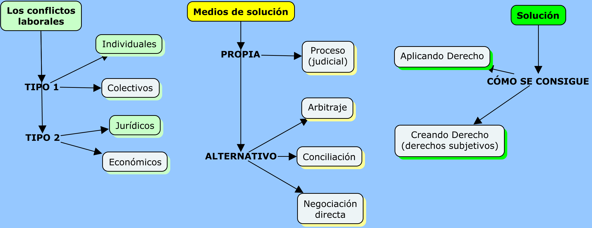

```{r, echo=FALSE}
xaringanExtra::use_webcam()
```

```{r setup, include=FALSE}
knitr::opts_chunk$set(warning = FALSE, message = FALSE, 
                      fig.retina = 3, fig.align = "center")
```

```{r xaringanExtra, echo=FALSE}
xaringanExtra::use_xaringan_extra(c("tile_view"))
```

class: center middle main-title section-title-4

# Los poderes de los jueces (2) y<br>los MARC

.class-info[

**Paul Paredes**

.light[
**TSS603 Procesos laborales<br>
Maestría en Derecho del Trabajo y de la Seguridad Social<br>
Pontificia Universidad Católica del Perú
]

**12 de abril de 2021**

]

---

class: middle

.box-4.huge[M1. Los conflictos laborales]

---

layout: true
class: title title-4

---

# Plan de la clase

&nbsp;

.box-inv-4[Rol de los jueces y las altas cortes]

&nbsp;

.box-inv-4[MARC: conciliación y arbitraje]

&nbsp;

.box-inv-4[Solución de los conflictos económicos]

---

layout: false
name: altas-cortes
class: center middle section-title section-title-4 animated fadeIn

# Rol de los jueces y las altas cortes

---

layout: true
class: title title-4

---

# Suplencia de la demanda

&nbsp;

.box-inv-4.large[¿Petitorio o pretensión implícitos?]

---
class: animated, fadeIn, middle

# CAS LAB 16940-2017 (5.12.2019)

> **Décimo Segundo:** Tal como se ha descrito, la litis ha discurrido respecto a la reposición por un despido incausado, al haberlo así propuesto el actor en su escrito de demanda, mas no, la desnaturalización de los contratos, lo que no importó que se ejerza también la defensa en dicho sentido, lo que conlleva a establecer que al haberse sentenciado, y otorgado el derecho por una pretensión no postulada, como es el caso de la desnaturalización de los contratos, se ha violentado el principio de congruencia procesal y por ende el debido proceso. 

???

1. Una propuesta de solución

+ Las oraciones y las proposiciones en el derecho

+ Las oraciones: conjunto de símbolos lingüísticos con sentido completo:
  + [ ] UNMSM
  + [ ] deseoso Lima estaba fruta aromática en otro
  + [ ] La Ciudad Blanca es la capital de Perú

2. Una propuesta de solución

+ Es usual distinguir entre oraciones asertivas (descriptivas::proposiciones) (V/F) y oraciones directivas (prescriptivas::normas) (Jus/Inj; Vál/Inv; Efi/Inef)

  + [ ] Juan trabaja en el Poder Judicial
  + [ ] María es mayor de edad
  + [ ] Está prohibido fumar en clase
  + [ ] Quien por dolo causa un daño a otro está obligado a repararlo

3. Una propuesta de solución

Las proposiciones son el significado expresado por las oraciones asertivas

  + María tiene 25 años de edad.
  + La edad de María es de 25 años.
  + Hace 25 años nació María.
  + María le lleva 3 años a su hermano Jorge quien ya tiene 22 años cumplidos.
  + No veo a María desde que cumplió 20 años. Han pasado 5 años desde ese entonces.

+ Varias oraciones asertivas pueden expresar la misma proposición

+ Los razonamientos se dan entre las proposiciones.

  =

+ Las premisas de los razonamientos son proposiciones y de estas se infiere otra proposición que es la conclusión.

+ Las premisas y conclusiones permiten construir cadenas argumentativas, conformadas por proposiciones.

---

# Una propuesta de solución (1)

.box-inv-4[Una conclusión no es sino una proposición derivada de una cadena argumentativa (los razonamientos) integrada por una serie de proposiciones.]

.box-inv-4[Esa conclusión podría ser el petitorio o la pretensión.]

---

# Una propuesta de solución (2)

.box-inv-4[¿Qué significaría la suplencia de la demanda en este contexto?]

--

.box-4["La determinación de la cadena de proposiciones]

--

.box-inv-4[¿Qué sería el petitorio implícito?]

--

.box-inv-4["La cadena de proposiciones que deriva **en** la pretensión explícita."]

---
class: animated, slideInRight
layout: false


---

layout: true
class: title title-4

---

# ¿Petitorio o pretensión implícitos?

.box-inv-4.medium[CAS LAB 16940-2017 (5 de diciembre de 2019)]

.box-inv-4[El "petitorio implícito" ¿afecta la congruencia?]

.box-inv-4[El "petitorio implícito" ¿vulnera el derecho de defensa?]

---

# La casación. Causales.
  
.box-inv-4[1.Infracción normativa que incide directamente sobre la decisión contenida en la resolución impugnada.]

.box-inv-4[2.Apartamiento de los precedentes vinculantes del TC o la CS.]

.box-inv-4[+(¿apartamiento inmotivado? ~ art. 386 CPC)]

???

> Ley 26636 | *Artículo 56.- CAUSALES.- Son causales para interponer el recurso de casación:*

>	*a) La aplicación indebida de una norma de derecho material.*

>	*b) La interpretación errónea de una norma de derecho material.*

>	*c) La inaplicación de una norma de derecho material.*

>	*d) La contradicción con otras resoluciones expedidas por la Corte Suprema de Justicia o las Cortes Superiores, pronunciadas en casos objetivamente similares, siempre que dicha contradicción esté referida a una de las causales anteriores.*

---

# Cas. Prec. vinculantes. Art. 40.° NLPT

.box-inv-4[La SCyS-CSJR **convoca** al pleno de los jueces supremos en materia constitucional y social.]
.box-inv-4[**Finalidad::** constituir o variar un precedente judicial.]
.box-inv-4[**Decisión::** por mayoría absoluta de los asistentes al pleno casatorio.]
.box-inv-4[**Consecuencia:: .red[vincula]** a los órganos jurisdiccionales hasta que sea modificada por otro precedente.]
.box-inv-4[Los abogados pueden **informar oralmente** en la vista de la causa ante el pleno casatorio.]

---

# La casación. Finalidad.

> Artículo 384.- Fines de la casación
El recurso de casación tiene por fines la adecuada aplicación del derecho objetivo al caso concreto y la uniformidad de la jurisprudencia nacional por la Corte Suprema de Justicia. (Ley 29364, del 28 mayo 2009).

> Artículo  384.- El recurso de casación tiene por fines esenciales la correcta aplicación e interpretación del derecho objetivo y la unificación de la jurisprudencia nacional por la Corte Suprema de Justicia. (Original).

???

La casación. Fines.

1. Función de nomofilaquia::

 a) Poner en evidencia los errores. Modelo de tercera instancia.

 b) Interpretación | justa | adecuada | correcta | mejor | ajustada a los valores, bienes, principios constitucionales | de la norma.

> CS elige entre valores. ¿Hacer derecho? Modelo de Corte Suprema.

2. Uniformidad (de la interpretación de la ley) por medio de la jurisprudencia nacional.
 
 a) Mera y formal unificación de la jurisprudencia. Modelo de tercera instancia.
 
 b) Uniformidad de la interpretación en los supuestos de hecho. (¿conservador vs. innovación?)
 
  > El precedente se vuelve significativo. Referencia para jurisprudencia uniforme.
  
  > El cambio de precedente rompe la uniformidad para crear una nueva.
 
---

# El rol de la Corte Suprema

.box-inv-4[Distinguir entre:]

.box-inv-4[1.Resoluciones emitidas en casación. Jurisprudencia. (art. 31, 39 NLPT).]

.box-inv-4[2.Resoluciones emitidas en casación. Precedentes vinculantes. (art. 40 NLPT) ~~ (art. 400 CPC).]

.box-inv-4[3.Plenos jurisdiccionales supremos en materia laboral. (art. 22 y 116 LOPJ).]

---

# Doctrina jurisprudencial (1)

.box-inv-4[¿Carácter vinculante de la doctrina jurisprudencial?]

> Artículo 22.- Las Salas Especializadas de la Corte Suprema de Justicia de la República ordenan la publicación trimestral en el Diario Oficial "El Peruano" de las Ejecutorias que fijan principios jurisprudenciales que han de ser de obligatorio cumplimiento, en todas las instancias judiciales.]

---

# Doctrina jurisprudencial (2)

> Estos principios deben ser invocados por los Magistrados de todas las instancias judiciales, cualquiera que sea su especialidad, como precedente de obligatorio cumplimiento. En caso que por excepción decidan apartarse de dicho criterio, están obligados a motivar adecuadamente su resolución dejando constancia del precedente obligatorio que desestiman y de los fundamentos que invocan.

---

# Doctrina jurisprudencial (3)

> Los fallos de la Corte Suprema de Justicia de la República pueden excepcionalmente apartarse en sus resoluciones jurisdiccionales, de su propio criterio jurisprudencial, motivando debidamente su resolución, lo que debe hacer conocer mediante nuevas publicaciones, también en el Diario Oficial "El Peruano", en cuyo caso debe hacer mención expresa del precedente que deja de ser obligatorio por el nuevo y de los fundamentos que invocan.

---

# Plenos jurisdiccionales

.box-inv-4[Plenos laborales nacionales, regionales o distritales.]

> Plenos jurisdiccionales.

> Artículo 116.- Los integrantes de las Salas Especializadas, pueden reunirse en plenos jurisdiccionales nacionales, regionales o distritales a fin de concordar jurisprudencia de su especialidad, a instancia de los órganos de apoyo del Poder Judicial.

---
class: animated, fadeIn

# Sala plena de la Corte Suprema

> Artículo 80.- Atribuciones de la Sala Plena de la Corte Suprema
Son atribuciones de la Sala Plena de la Corte Suprema de Justicia de la República:

> 4.Sistematizar y difundir la jurisprudencia de las Salas Especializadas de la Corte Suprema y disponer la publicación trimestral de las Ejecutorias que fijen principios jurisprudenciales que han de ser de obligatorio cumplimiento en todas las instancias judiciales.

---

layout: false
name: marc
class: center middle section-title section-title-4 animated fadeIn

# Los mecanismos alternativos de resolución de conflictos

---

layout: true
class: title title-4

---

# Caso 1:

.box-inv-4.small[Un trabajador después de 35 años de servicios es despedido imputándosele la comisión de una falta grave. Esta consiste en el incumplimiento de sus obligaciones de trabajo que supone el quebrantamiento de la buena fe laboral. El trabajador entra en contacto con su exempleador y luego de varias reuniones han llegado al siguiente acuerdo:]

.box-inv-4.small[1.El trabajador (extrabajador) se compromete a no interponer ninguna demanda y, en caso que la hubiese interpuesto, se compromete a desistirse de la pretensión. Declara que no tiene nada que reclamar a su empleador.]

.box-inv-4.small[2.A cambio, el empleador se compromete --y cumple-- contratar al hijo menor de su extrabajador.]

---

# Caso 2:

.box-inv-4.small[Un trabajador después de más de 10 años de servicios reclama el pago de sus beneficios sociales a su empleador. Nunca le entregó recibo, ni boletas, pero cada fin de mes le pagaba el monto acordado: S/750.00. El extrabajador solicita el pago de las gratificaciones legales, asignación familiar, CTS y, en general, los beneficios que por ley corresponden a los trabajadores sujetos a la actividad privada. El exempleador tiene la voluntad de llegar a un acuerdo. Uno de los puntos de discusión es la fecha de inicio, pues desde esa fecha empezaría el reconocimiento de los derechos. Luego de varias conversaciones las partes llegan al siguiente acuerdo:]

.box-inv-4.small[1.Considerar como fecha de ingreso el 1 de julio de 2015. 2. Calcular los beneficios de ley considerando la suma de S/750.00. 3. Pagar la suma que arroje dicho cálculo en el plazo de 3 días hábiles.]

---

# Caso 3

.box-inv-4.small[Juan tiene en su contrato de trabajo una cláusula en la cual se indica que el empleador se compromete a brindar todas las facilidades que resulten necesarias para la adecuada prestación del servicio, incluyendo facilidades para el traslado a su centro de trabajo. Juan se acaba de comprar un automóvil último modelo. Juan piensa que su empleador debe darle un espacio para estacionar su moderno vehículo o, en todo caso, pagarle la cochera. Su empleador le acaba de responder que "ni hablar, de ninguna manera".]

---

# Caso 4

.box-inv-4.normal[Lo mismo que el caso 1 pero la cláusula no está contenida en el contrato de trabajo sino en el convenio colectivo del año 1998.]

---

# Caso 5

.box-inv-4.small[[Asuma que el caso se da antes de la Ley 31047] Andrés está sujeto al régimen laboral del trabajo doméstico. Su remuneración mensual es de S/200.00. Andrés cree que debe ganar S/930.00 pero le siguen pagando S/200.00. ¿Andrés debería reclamar? ¿Qué le aconsejaría usted?]

---

# Caso 6

.box-inv-4[En la sección de "Acabados" trabajan 27 operarios en un espacio de poco más de 50 m<sup>2</sup>. Hace mucho calor, incluso en invierno. Los trabajadores han solicitado que la empresa coloque aire acondicionado pero les han contestado que no están obligados a ello. El sindicato piensa incluir dicho punto en el próximo pliego de reclamos. ¿Qué les diría usted?]


---

# Conflictos, medios y solución

&nbsp;


---

# Los conflictos laborales


---

# Los conflictos laborales


---

# Medios de solución


---

# Medios de solución


---

# Solución



---

# Solución


---

# MARCs: conciliación y arbitraje

1. Conciliación

+ Es un mecanismo para resolver un conflicto de intereses.

+ ¿De qué manera se resuelve un conflicto en conciliación?

+ Mediante el acuerdo:: llegando a un acuerdo.

> Es el acuerdo lo que pone fin al conflicto.

> Es el acuerdo el modo de resolver el conflicto.

---

# 1. Conciliación

+ ¿Ese .red[acuerdo] tiene algún parámetro de validez? **Tesis 1**

.box-inv-4.small[1.**.red[El derecho]:: derechos disponibles de las partes**

 > (D. Leg. 1070) Artículo 7.- Materias conciliables
 
 > Son materia de conciliación las pretensiones determinadas o determinables que versen sobre derechos disponibles de las partes.

 + Entonces, solo los derechos laborales disponibles serían susceptibles de conciliar.

2.**.red[Los hechos]:: la verdad como correspondencia**]

---

# Parámetros de validez del acuerdo adoptado en conciliación

.box-inv-4.small[<ol start=2>
2.  .red[Los hechos]:: la verdad como correspondencia
</ol>

+ Verdad como correspondencia con la realidad: `"La afirmación 'La Tierra es plana' es V/F porque hay suficientes elementos de corroboración de lo afirmado".`
  
+ Verdad como consenso: acuerdo: `"Todos (la mayoría, algunos, alguien) acordamos que 'La Tierra es plana'."` + Los motivos del acuerdo pueden ser las creencias, la conveniencia, la utilidad, etc.

+ Verdad como persuasión: victoria en el ánimo, en la conciencia del decisor: `"Tengo la convicción, la certeza, de que 'la Tierra es plana'."`]


---

# 1. Conciliación

+ ¿Ese .red[acuerdo] tiene algún parámetro de validez? **Tesis 2**

- **El principio dispositivo**

  + Iniciativa de parte

  + Según lo alegado y probado"

> Yo soy dueño de mis conflictos

> Yo los propongo, yo los concluyo

---

# 1. La NLPT y la conciliación

Características del acuerdo en conciliación:

  1. Libre

  2. Informado

  3. De buena fe

---

# 2. El arbitraje jurídico laboral

+ Es un mecanismo para resolver un conflicto de intereses.

+ ¿De qué manera se resuelve un conflicto jurídico en arbitraje?

+ Aplicando derecho

---

# 2. El arbitraje jurídico

.box-inv-4.small[+ Parámetros de validez del acuerdo de someter el conflicto a arbitraje jurídico

1.**.red[El derecho]:: derechos disponibles de las partes y aquellas que la ley autorice**

 > (D. Leg. 1071) Artículo 2.- Materias susceptibles de arbitraje.

 > 1. Pueden someterse a arbitraje las controversias sobre materias de libre disposición conforme a derecho, así como aquellas que la ley o los tratados o acuerdos internacionales autoricen.

 + Entonces, solo los derechos laborales disponibles serían susceptibles de llevar a arbitraje. + Pero también podría sostenerse que `lo laboral` es una materia autorizada por ley.]

---

# 2. El arbitraje jurídico

+ Parámetros de validez del acuerdo de someter el conflicto a arbitraje jurídico

 > (NLPT. Disp. Complem.) SEXTA.- Las controversias jurídicas en materia laboral pueden ser sometidas a arbitraje, siempre y cuando el convenio arbitral se inserte a la conclusión de la relación laboral y, adicionalmente, la remuneración mensual percibida sea, o haya sido, superior a las setenta (70) Unidades de Referencia Procesal (URP).


---

# 2. El arbitraje jurídico


 Debe cumplir 2 condiciones:

 1. El convenio arbitral solo puede pactarse a la conclusión de la relación laboral; y,

 2. La remuneración mensual percibida debe haber sido mayor a 70 URP (en 2020 > S/30,100)

---

# 2. La NLPT y el arbitraje jurídico

Características del acuerdo que somete el conflicto a arbitraje jurídico:

  1. Libre

  2. Con garantía de solvencia

  3. De buena fe


---

# ¿Cuál es la función del proceso?

1. El proceso como mero mecanismo de resolución de controversias .red[antes] que como `actuación del derecho:: antes que como decir derecho:: aplicar derecho`.

2. El proceso como instancia de `construcción de una realidad para persuadir al juzgador`.

3. El proceso como un `mecanismo de solución de conflictos donde se aplica el derecho vigente en un país sobre los hechos sucedidos` antes que como mera instancia de resolución de controversias.

---

# Comparación (1)

<style type="text/css">
.tg  {border-collapse:collapse;border-spacing:0;}
.tg td{border-color:black;border-style:solid;border-width:1px;font-family:Arial, sans-serif;font-size:14px;
  overflow:hidden;padding:10px 5px;word-break:normal;}
.tg th{border-color:black;border-style:solid;border-width:1px;font-family:Arial, sans-serif;font-size:14px;
  font-weight:normal;overflow:hidden;padding:10px 5px;word-break:normal;}
.tg .tg-umkb{background-color:#67fd9a;border-color:#000000;font-family:Georgia, serif !important;;font-size:16px;text-align:left;
  vertical-align:top}
.tg .tg-10x8{background-color:#c0c0c0;border-color:#000000;font-family:Georgia, serif !important;;font-size:16px;font-weight:bold;
  text-align:left;vertical-align:top}
.tg .tg-bhpe{background-color:#67fd9a;border-color:#000000;font-family:Georgia, serif !important;;font-size:16px;font-weight:bold;
  text-align:center;vertical-align:top}
.tg .tg-3245{border-color:#000000;font-family:Georgia, serif !important;;font-size:16px;text-align:left;vertical-align:top}
.tg .tg-k6mb{border-color:#000000;font-family:Georgia, serif !important;;font-size:16px;text-align:center;vertical-align:top}
</style>
<table class="tg">
<thead>
  <tr>
    <th class="tg-umkb"></th>
    <th class="tg-bhpe">Conflicto jurídico</th>
    <th class="tg-bhpe">Conflicto económico</th>
  </tr>
</thead>
<tbody>
  <tr>
    <td class="tg-10x8">Origen</td>
    <td class="tg-3245">Un conflicto, una insatisfacción</td>
    <td class="tg-3245">Un conflicto, una insatisfacción</td>
  </tr>
  <tr>
    <td class="tg-10x8">¿Cómo resolverlo?</td>
    <td class="tg-3245">Aplicando derecho:<br>ello supone que existe una norma que contiene la solución,<br>entonces, lo que se pide es aplicar la norma, o,<br>interpretarla del modo como se pretende</td>
    <td class="tg-3245">Creando derecho:<br>ello supone que no existe la norma que contiene la solución,<br>o que la que existe es insuficiente (vaga, ambigua),<br>o para garantizar mejor un derecho</td>
  </tr>
  <tr>
    <td class="tg-10x8">Medio típico de aplicación de derecho</td>
    <td class="tg-3245">La sentencia</td>
    <td class="tg-k6mb">---</td>
  </tr>
  <tr>
    <td class="tg-10x8">Medio típico de creación de derecho</td>
    <td class="tg-k6mb">---</td>
    <td class="tg-3245">El acuerdo contractual,<br>El consenso legislativo,<br>El convenio colectivo</td>
  </tr>
  <tr>
    <td class="tg-10x8">Vía típica de canalización</td>
    <td class="tg-3245">El proceso (judicial)</td>
    <td class="tg-3245">El procedimiento legislativo<br>La negociación<br>La conciliación<br>La negociación colectiva</td>
  </tr>
</tbody>
</table>

---

# Comparación (2)

<style type="text/css">
.tg  {border-collapse:collapse;border-spacing:0;}
.tg td{border-color:black;border-style:solid;border-width:1px;font-family:Arial, sans-serif;font-size:14px;
  overflow:hidden;padding:10px 5px;word-break:normal;}
.tg th{border-color:black;border-style:solid;border-width:1px;font-family:Arial, sans-serif;font-size:14px;
  font-weight:normal;overflow:hidden;padding:10px 5px;word-break:normal;}
.tg .tg-umkb{background-color:#67fd9a;border-color:#000000;font-family:Georgia, serif !important;;font-size:16px;text-align:left;
  vertical-align:top}
.tg .tg-10x8{background-color:#c0c0c0;border-color:#000000;font-family:Georgia, serif !important;;font-size:16px;font-weight:bold;
  text-align:left;vertical-align:top}
.tg .tg-bhpe{background-color:#67fd9a;border-color:#000000;font-family:Georgia, serif !important;;font-size:16px;font-weight:bold;
  text-align:center;vertical-align:top}
.tg .tg-3245{border-color:#000000;font-family:Georgia, serif !important;;font-size:16px;text-align:left;vertical-align:top}
</style>
<table class="tg">
<thead>
  <tr>
    <th class="tg-umkb"></th>
    <th class="tg-bhpe">Conflicto jurídico</th>
    <th class="tg-bhpe">Conflicto económico</th>
  </tr>
</thead>
<tbody>
  <tr>
    <td class="tg-10x8">Vías alternativas</td>
    <td class="tg-3245">La conciliación<br>La mediación<br>El arbitraje</td>
    <td class="tg-3245">La conciliación<br>La mediación<br>El arbitraje<br>La huelga</td>
  </tr>
  <tr>
    <td class="tg-10x8">Acto de presentación (postulación)</td>
    <td class="tg-3245">La demanda</td>
    <td class="tg-3245">La propuesta legislativa<br>La propuesta contractual<br>El pliego de reclamos</td>
  </tr>
  <tr>
    <td class="tg-10x8">Resultado o producto</td>
    <td class="tg-3245">La sentencia<br>El acuerdo en conciliación*<br>La transacción*<br>El laudo arbitral jurídico</td>
    <td class="tg-3245">La ley<br>El contrato<br>El acuerdo en conciliación<br>El laudo arbitral económico</td>
  </tr>
  <tr>
    <td class="tg-10x8">Consecuencia respecto del resultado</td>
    <td class="tg-3245">Se cumple.<br>Si no: proceso de ejecución</td>
    <td class="tg-3245">Se cumple.<br>Si no: proceso de conocimiento</td>
  </tr>
</tbody>
</table>

---

layout: false
name: gracias
class: center middle section-title section-title-4 animated fadeIn

# ¡Muchas gracias!


```{r echo=FALSE, include=FALSE, eval=FALSE}
pagedown::chrome_print("proceso_y_mecanismos-alternativos.html", 
                       output = "proceso_y_mecanismo-alternativos.pdf")
```
